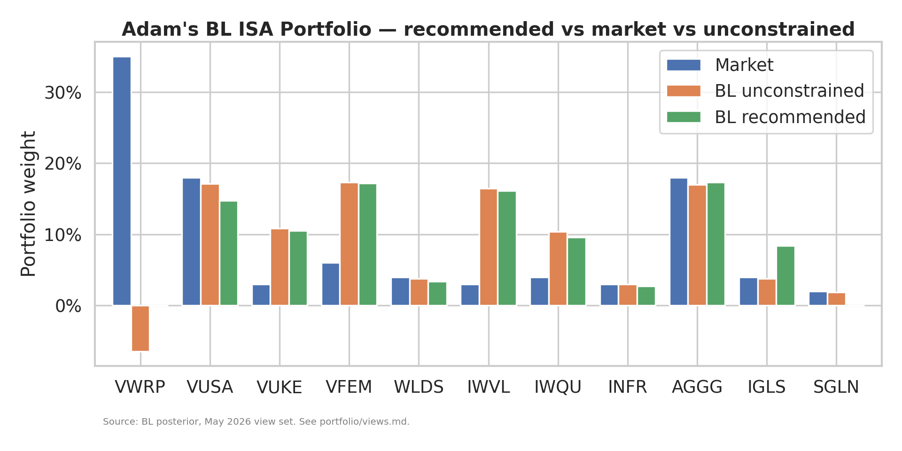
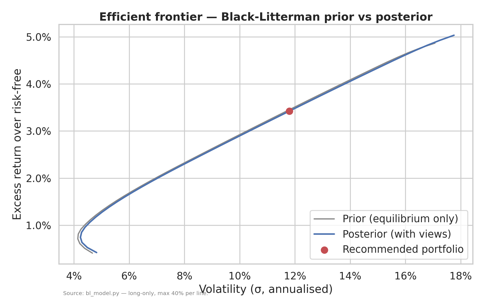
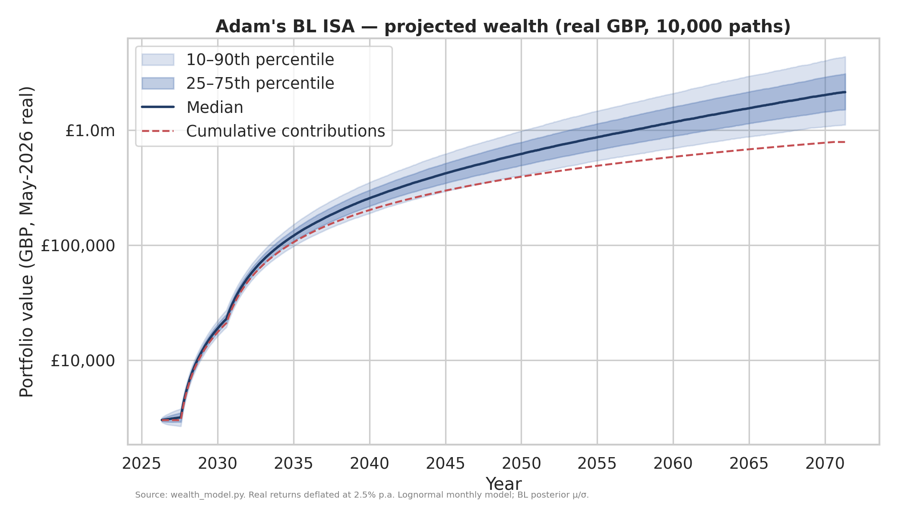

# Adam's Black-Litterman ISA Portfolio

*Long-horizon, tax-wrapped, GBP-denominated. Built May 2026.*

---

## Executive Summary

This repository builds, optimises, and documents a production-grade long-term investment portfolio for **Adam**, a UK-domiciled retail investor with a ~45-year horizon and a moderately-high risk tolerance, invested through a Stocks & Shares ISA.

The portfolio uses the **Black-Litterman (BL)** framework to combine the wisdom of the global market portfolio (the equilibrium prior) with five explicit, justified views about expected returns over the next 5–10 years. The output is a diversified 9-line allocation across global equities, regional / factor tilts, listed infrastructure, global bonds, short gilts, and gold.

**Key headline numbers** (BL posterior, run 17 May 2026):

| Metric | BL Recommended | 60/40 (VWRP/AGGG) | 100% MSCI ACWI (VWRP) |
|---|---|---|---|
| Expected nominal return | **7.42%** | 6.67% | 8.24% |
| Volatility | **11.80%** | 9.67% | 15.29% |
| Sharpe (over 4.0% rf) | **0.29** | 0.28 | 0.28 |
| Blended TER | **~0.19%** | 0.16% | 0.22% |

**Wealth projection** — Monte Carlo, 10,000 paths, real GBP:

| Age | 10th pct | Median | 90th pct |
|---|---|---|---|
| 30 | £27,012 | £31,316 | £36,566 |
| 40 | £210,838 | £285,745 | £396,688 |
| 50 | £428,404 | £666,176 | £1,063,358 |
| 60 | £731,026 | £1,242,002 | £2,254,771 |
| 65 | £908,275 | £1,641,786 | £3,111,756 |
| 70 | £1,103,159 | £2,120,331 | £4,279,644 |

**Probability of reaching a real-GBP wealth target by 2070:**

- £1m: **94%** (median path: hit by 2055, age 54)
- £2m: **55%**
- £5m: **6%**
- £10m: <1%

---

## The Black-Litterman Framework (plain English + equations)

Classical mean-variance optimisation (Markowitz, 1952) requires the user to feed in expected returns for every asset. The output is famously unstable — small errors in inputs become huge swings in weights, often producing extreme corner portfolios.

**Black-Litterman** (Goldman Sachs, 1992) inverts the problem:

1. **Start from the market portfolio.** If markets are roughly efficient, the cap-weighted market portfolio is itself the optimal portfolio for the *consensus* set of return expectations. Run the optimiser backwards (`π = δ Σ w_mkt`) to recover those *implied equilibrium returns*. This is the **prior**.
2. **Express views** as a small number of statements of the form "Asset A will outperform Asset B by X% per year". Each view carries a **confidence** level (uncertainty).
3. **Combine** prior and views by Bayesian updating to produce a **posterior** set of expected returns — the prior tilted toward the views, in proportion to the views' confidence. Plug the posterior into a standard mean-variance optimiser and the resulting weights are well-behaved, intuitive, and reflect the views in proportion to how confident the investor is.

The mathematics (full derivation in `portfolio/bl_model.py`):

| Step | Equation |
|---|---|
| Implied equilibrium returns | **π = δ Σ w_mkt** |
| Posterior expected returns | **μ\* = π + τΣPᵀ(PτΣPᵀ + Ω)⁻¹(Q − Pπ)** |
| Posterior covariance (He–Litterman) | **Σ\* = Σ + [(τΣ)⁻¹ + PᵀΩ⁻¹P]⁻¹** |
| Unconstrained optimal weights | **w\* = (δΣ\*)⁻¹μ\*** |

where Σ is the prior asset covariance, δ is the investor's risk-aversion coefficient, τ is a scalar reflecting overall prior uncertainty, `P` is the views matrix, `Q` the view returns, and Ω the views' covariance (typically diagonal).

In words: **the posterior is a precision-weighted average of the equilibrium prior and the investor's views.** High-confidence views dominate; low-confidence views barely move the prior at all.

---

## Asset Universe & Rationale

All instruments are Ireland-domiciled UCITS, LSE-listed in GBP, low-cost, and ISA-eligible. Full screening notes in `research/asset_universe_research.md`; consolidated table in `portfolio/universe.md`.

| Ticker | Name | TER | Role in the portfolio |
|---|---|---|---|
| VWRP | Vanguard FTSE All-World | 0.22% | Equity-market prior anchor |
| VUSA | Vanguard S&P 500 | 0.07% | US large-cap tilt |
| VUKE | Vanguard FTSE 100 | 0.09% | UK home-currency tilt (View 3) |
| VFEM | Vanguard FTSE EM | 0.22% | Emerging markets (View 1) |
| WLDS | iShares MSCI World Small Cap | 0.35% | Size premium |
| IWVL | iShares Edge MSCI World Value | 0.30% | Value factor (View 2) |
| IWQU | iShares Edge MSCI World Quality | 0.30% | Quality factor (View 5) |
| INFR | iShares Global Infrastructure | 0.40% | Real-asset / inflation sleeve (View 4) |
| AGGG | iShares Core Global Aggregate (GBP-Hedged) | 0.10% | Bond ballast |
| IGLS | iShares UK Gilts 0-5yr | 0.07% | Near-cash sterling reserve |
| SGLN | iShares Physical Gold ETC | 0.12% | Tail-risk hedge |

---

## Investor Views & Economic Rationale

Five views drive the posterior tilt away from the market portfolio. Full justification in `portfolio/views.md`.

| # | View | Q (excess) | Confidence (Ω diag) |
|---|---|---|---|
| 1 | EM equities > global by 2.0% p.a. (valuation gap + demographics) | +2.0% | 0.0015 |
| 2 | Value > Growth by 1.5% p.a. (P/B spread at 92nd percentile) | +1.5% | 0.0015 |
| 3 | UK > global by 1.0% p.a. (12x P/E vs 19x; PPP undervaluation) | +1.0% | 0.0030 |
| 4 | Infrastructure > global bonds by 3.0% p.a. (real-yield gap) | +3.0% | 0.0015 |
| 5 | Quality > global by 0.5% p.a. (defensive late-cycle tilt) | +0.5% | 0.0030 |

---

## Portfolio Allocation (the final table)

Constrained BL output (long-only, max 40%, min 2% if held). On a £3,000 initial deployment:

| Ticker | Weight | £ amount | Asset class |
|---|---|---|---|
| VFEM | 17.2% | £515 | Emerging markets |
| AGGG | 17.3% | £520 | Global aggregate bonds (GBP-hedged) |
| IWVL | 16.1% | £484 | Value factor |
| VUSA | 14.8% | £443 | US large-cap |
| VUKE | 10.5% | £316 | UK large-cap |
| IWQU | 9.6% | £287 | Quality factor |
| IGLS | 8.4% | £253 | Short-dated gilts |
| WLDS | 3.4% | £101 | Global small cap |
| INFR | 2.7% | £82 | Infrastructure |
| VWRP | 0.0% | — | (Bumped to 0 by the min-weight rule; covered by tilts) |
| SGLN | 0.0% | — | (Bumped to 0 by the min-weight rule) |
| **Total** | **100.0%** | **£3,001** | |

> The optimiser drops `VWRP` and `SGLN` because the BL posterior view-set already expresses the regional / factor tilts more efficiently through `VFEM`, `IWVL`, `IWQU`, etc. (a market-weight VWRP overlap would be double-counting). If you prefer a single-line core for simplicity, the unconstrained solution shows the same answer in distributed form — see `portfolio/results/optimal_weights.csv`.

**Sleeve roll-up:** Equities (incl. factors) **71.5%**, Real assets **2.7%**, Bonds **25.7%**, Gold 0.0%.

Allocation chart:



Efficient frontier (prior vs posterior):



---

## Expected Performance Statistics

| Statistic | Value |
|---|---|
| Expected nominal return | 7.42% |
| Expected **real** return (vs 2.5% inflation) | 4.80% |
| Volatility (annualised) | 11.80% |
| Sharpe ratio (over 4.0% rf) | 0.29 |
| Estimated 1-in-20 year drawdown | ~25–30% |
| Blended TER | 0.19% |
| Stamp duty on purchases | 0% (UK ETFs are exempt) |

Versus naive benchmarks (see `portfolio/results/portfolio_metrics.csv`):

- **vs 60/40 (VWRP/AGGG):** the BL portfolio earns +75 bps of expected return per year at +213 bps of vol — a virtually identical Sharpe, but with the additional return.
- **vs 100% MSCI ACWI:** the BL portfolio gives up 82 bps of expected return for 349 bps less volatility — Sharpe is materially higher, drawdowns are much shallower, and the path to retirement is more comfortable.

---

## Wealth Projections (with fan chart inline)

Monte Carlo: 10,000 paths, monthly lognormal returns, real GBP, BL posterior μ/σ.



**Probability of reaching real-GBP wealth targets by the 2070 terminal date:**

| Target | Prob. ever reached | Prob. at horizon end |
|---|---|---|
| £1,000,000 | 97% | 94% |
| £2,000,000 | 64% | 55% |
| £5,000,000 | 8% | 6% |
| £10,000,000 | < 1% | < 1% |

**Sensitivity to ±1% on the expected return:** the median terminal value moves between ~£1.7m (μ −1%) and ~£2.75m (μ +1%), illustrating just how powerful 45 years of compounding makes the expected-return assumption. The full sensitivity table sits in `projections/results/scenario_table.csv`.

---

## Risk Factors & Caveats

The ten risks documented in full in `docs/risks_and_assumptions.md`, summarised:

1. **Model risk** — BL outputs are sensitive to τ, Ω and Σ.
2. **Estimation error** in the covariance matrix.
3. **Non-normality** — fat tails understated by lognormal MC.
4. **Sequence-of-returns risk** — Phase 1 drawdowns hurt most.
5. **Currency risk** — ~50% USD exposure, unhedged.
6. **Political / regulatory** — ISA rules may change.
7. **Platform risk** — FSCS protects £85k; multi-platform > 2032.
8. **Inflation risk** — real returns sensitive to deflator choice.
9. **Behavioural** — staying invested through drawdowns is non-trivial.
10. **Liquidity** — small ETF lines can widen in stress; use limits.

---

## Implementation Guide (summary)

Full step-by-step in `docs/implementation_guide.md`.

- **Platform:** Trading 212 ISA today; review for Hargreaves Lansdown switch once portfolio > ~£200k.
- **Initial trades:** invest the £3,000 across the 9 active lines on day one using limit orders during 10:00–15:30.
- **Contributions:** £500/month from Sep 2027, stepping to £1,600/month from Sep 2030 — directed each month into the most underweight line.
- **Rebalancing:** annual every April + 5% drift trigger + contribution-driven micro-rebalance.
- **ISA limit:** £1,600/month = £19,200/year, comfortably under the £20,000 cap.

---

## Rebalancing & Maintenance

- **Monthly:** direct contributions to most-underweight lines (zero-cost rebalancing).
- **Annually (every April):** re-run `bl_model.py` with refreshed views, refreshed market caps, and refreshed correlations. Update `portfolio/views.md` where views have materially changed. Trade the difference.
- **Quinquennially (every 5 years):** revisit the entire universe — TERs and product launches move on; better instruments may have appeared.
- **At age 50 / 55 / 60 / 65:** shift down the equity glide-path (see `docs/implementation_guide.md` §7).

---

## Appendix A — BL Model Equations

```
π          = δ · Σ · w_mkt                                  (prior)
μ*         = π + τΣ Pᵀ (PτΣPᵀ + Ω)⁻¹ (Q − Pπ)              (posterior mean)
Σ*         = Σ + [(τΣ)⁻¹ + Pᵀ Ω⁻¹ P]⁻¹                     (posterior cov)
w*_unc     = (δΣ*)⁻¹ μ*                                     (unconstrained)
w*_con     = argmaxw  μ*ᵀw − ½δ wᵀΣ*w   s.t. Σw=1, 0≤w≤0.40 (constrained)
```

Hyperparameters used: τ = 0.05, δ = 2.5, rf = 4.0%.

---

## Appendix B — Data Sources

See `research/sources.md` for the full bibliography. Key sources:

- He, G. & Litterman, R. (1999) — *The Intuition Behind Black-Litterman Model Portfolios*
- Idzorek, T. (2005) — *A Step-by-Step Guide to the Black-Litterman Model*
- Dimson, Marsh, Staunton — *UBS Global Investment Returns Yearbook 2024*
- Vanguard CMAs (2024); Research Affiliates AAI (2026)
- MSCI, FTSE Russell, Bloomberg index factsheets
- IMF WEO (April 2026); Bank of England MPR (May 2026)

---

## Appendix C — Assumptions

Single-page summary table in `docs/risks_and_assumptions.md`. Headline numbers: τ = 0.05; δ = 2.5; rf = 4.0%; inflation = 2.5%; equity vols 14–21%; bond vols 3–5.5%; ISA cap £20,000/year; 10,000 MC paths; horizon 45 years.

---

## How to reproduce

```bash
pip install numpy scipy pandas matplotlib seaborn

# Build the portfolio
python portfolio/bl_model.py

# Project the wealth path
python projections/wealth_model.py
```

Outputs land in `portfolio/results/` and `projections/results/`.

---

*This document was prepared for Adam's personal long-term ISA portfolio planning. It is not regulated financial advice. Adam — and any future reader — should re-validate the views, return assumptions, and platform fees before placing any trades.*
