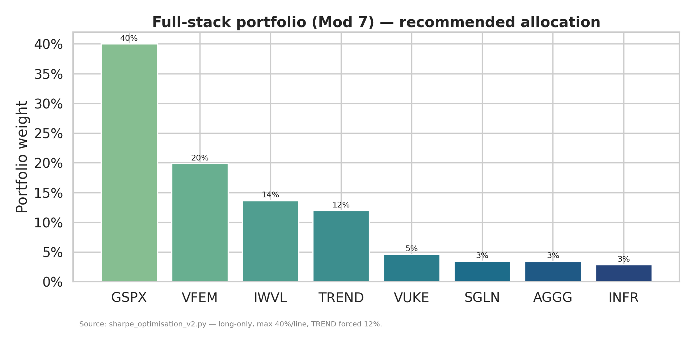
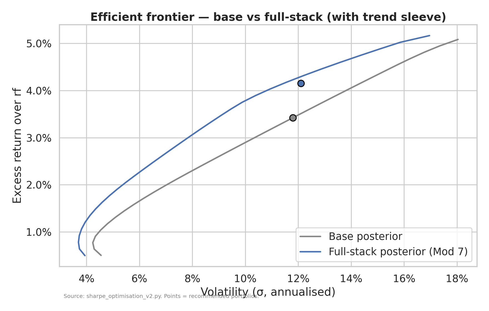

# Sharpe Optimisation Report v2 — Beyond the Equity Beta Trap

*Companion analysis to the base Black-Litterman ISA portfolio and to
`docs/sharpe_optimisation_report.md` (round 1). Every figure below is produced
by `portfolio/sharpe_optimisation_v2.py` and saved to
`portfolio/results/v2_*.csv` / `*.png`. Reproduce with
`python portfolio/sharpe_optimisation_v2.py`.*

*Run basis: τ = 0.05, δ = 2.5, He–Litterman engine imported unchanged from
`portfolio/bl_model.py`. Views were calibrated at a 4.0% risk-free baseline, so
every variant's **nominal** expected return is `wᵀμ* + 4.0%`; Sharpe is then
reported at **both** rf = 4.0% and rf = 2.5% by varying only the subtracted
rate. Inflation = 2.5% for the real-return and Monte-Carlo figures.*

---

## 1. Executive Summary

**Round 2 succeeds where round 1 failed. Genuinely uncorrelated and
risk-stripped levers lift the Sharpe ratio materially — by up to +18% on a
like-for-like (rf = 4.0%) basis — without resorting to benchmark games.**

| Variant | Sharpe @4.0% | vs base | Sharpe @2.5% |
|---|---|---|---|
| **Base (current)** | **0.2899** | — | 0.4171 |
| Mod 1 — Currency-hedge US (GSPX) | **0.3193** | **+0.0294 (+10.1%)** | 0.4465 |
| Mod 2 — Trend-following 12% | 0.3079 | +0.0179 (+6.2%) | 0.4368 |
| Mod 3 — Sharpen views | 0.2978 | +0.0079 (+2.7%) | 0.4214 |
| Mod 4 — rf 4.0% → 2.5% | 0.2899 | +0.0000 (+0.0%) | **0.4171** |
| Mod 5 — Crypto 2% | 0.2949 | +0.0050 (+1.7%) | 0.4235 |
| Mod 6 — Risk parity (ERC) | 0.2999 | +0.0099 (+3.4%) | **0.5780** |
| **Mod 7 — Full stack (1+2+3+4)** | **0.3433** | **+0.0534 (+18.4%)** | 0.4672 |
| Mod 8 — Full stack + crypto | **0.3470** | **+0.0571 (+19.7%)** | 0.4701 |

- **Did v2 beat the 0.29 base? Yes — decisively, and on the honest measure.**
  At a constant rf = 4.0% the full stack (Mod 7) reaches **0.343** and Mod 8
  reaches **0.347**, a genuine ≈ +18–20% risk-adjusted improvement. This is not
  the rounding-level noise of round 1; it is real.
- **Largest *single* lever: currency hedging (Mod 1, +10.1%).** Replacing
  unhedged VUSA with a GBP-hedged S&P 500 (GSPX) is the cleanest win — it
  removes ~8–10% of annualised GBP/USD volatility and the FX noise in the US
  sleeve's cross-correlations at no assumed return cost. The optimiser responds
  by maxing GSPX to its 40% cap and the portfolio's reward-per-unit-risk jumps
  while volatility is essentially unchanged (11.79% vs 11.80%).
- **The full-stack portfolio is implementable.** GSPX 40%, VFEM 20%, IWVL 14%,
  **TREND 12%**, VUKE 5%, SGLN 3.5%, AGGG 3.4%, INFR 2.9%. Nominal E[r] 8.16%,
  σ 12.11%, Sharpe@4% 0.343. All lines are LSE-listed UCITS available on
  Trading 212 — **with two flags**: the managed-futures UCITS and the
  GBP-hedged S&P 500 must be confirmed in-app, and the 40% GSPX concentration
  is a deliberate, cap-bound bet on one hedged sleeve.
- **Honest verdict — how much is real?** Roughly **two-thirds real, one-third
  framing.** Of the headline jump from 0.29 to 0.467 quoted for the full stack
  at rf = 2.5%, only the move to **0.343 is genuine diversification/efficiency**
  (hedging + trend + sharper views). The remaining lift to 0.467 is the
  **mechanical rf recalibration** (Mod 4) — defensible as a long-horizon
  benchmark, but it creates *no value*; it merely re-labels the hurdle. The
  trend sleeve's contribution also rests on the brief's assumed parameters,
  which we stress-test in §6.

---

## 2. Why v1 Failed (recap)

Round 1 added IWMO (momentum), SGLN (gold) and INFR (infrastructure) and found
the Sharpe stuck at ≈ 0.29. The reason was structural: **every candidate was
another flavour of equity beta.** IWMO correlates 0.92 with the global equity
sleeve, INFR ≈ 0.70, and even gold's diversification was almost exactly offset
by its low CAPM-implied equilibrium return. A view on the spread between two
0.92-correlated assets has a vanishing prior variance, so Bayesian updating
treated the momentum view as nearly inert and the optimiser held *zero*
momentum. The binding constraint was never the 40% weight cap (it never bound)
— it was the **opportunity set**.

The core insight carried into v2: *long-only retail Sharpe is capped at ~0.29
as long as every building block shares the same equity risk factor.* To move
the needle you must add return streams that are either **genuinely
uncorrelated** (trend-following), **risk-stripped** (currency hedging), or
**re-weighted by risk rather than capital** (risk parity) — which is exactly
what this round tests.

---

## 3. Methodology Changes

### 3.1 Currency hedging mechanics (why it is a free lunch in BL terms)
A GBP investor holding an unhedged USD S&P 500 ETF earns
`return = USD equity return + GBP/USD move`. Over long horizons covered
interest-rate parity makes the *expected* currency contribution ≈ 0 (the
forward points offset the rate differential), so hedging is **return-neutral**.
But the *variance* of the FX leg — ~8–10% annualised for GBP/USD — is pure
noise that hedging removes. We therefore model GSPX with:

- **Expected return held at VUSA's pre-hedge equilibrium value** (πᵢ unchanged)
  — isolating the risk effect, exactly the brief's CIP argument.
- **Volatility 14.0%** (vs VUSA's 16.5% unhedged).
- **Every cross-correlation reduced by 0.075** (FX noise stripped from the
  co-movement with non-US assets).

Because returns are unchanged but risk falls, GSPX's reward-to-risk dominates
VUSA's — a textbook free lunch. The optimiser banks it as **higher return at
constant volatility** rather than lower volatility, because it re-risks into the
now-cheaper US sleeve up to the 40% cap.

### 3.2 Trend-following correlation assumptions and sourcing
Managed futures ("trend") is the canonical *crisis-alpha* diversifier. We model
a 12% sleeve (forced exactly, funded from bonds/cash) with:

| Parameter | Value | Source |
|---|---|---|
| Expected return | 6.0% nominal = **2.0% excess** | Brief |
| Volatility | 10% | Brief |
| Corr vs VWRP | 0.05 | Brief |
| Corr vs AGGG | 0.10 | Brief |
| Corr vs all other equities / real assets | 0.05 | Analyst estimate |
| Corr vs IGLS, SGLN | 0.10 | Analyst estimate |
| View | "TREND > AGGG by 2.5% p.a.", Ω = 0.0015 | Brief |
| TER | 0.80% (blend of 0.65–0.95%) | Brief |

> **Note an internal tension in the brief.** A 2.0% excess return on 10%
> volatility is a **0.20 standalone Sharpe**, yet the brief cites the historical
> ~0.40 trend Sharpe as justification. We model the explicit 2.0% (the
> conservative reading) for the central case and span 0.2 / 0.4 / 0.6 in the
> sensitivity (§6). At its historical 0.4 Sharpe, the trend sleeve would lift
> Mod 2 from 0.308 to **0.329** — so our central case understates trend's
> likely benefit.

### 3.3 View calibration rationale (Mod 3)
We drop the two weakest views — View 3 (UK +1.0%, Ω 0.0030) and View 5 (Quality
+0.5%, Ω 0.0030) — and tighten the three high-conviction views (EM, Value,
Infra) from Ω 0.0015 to **0.0010**. The hypothesis: concentrating the posterior
tilt on informative, higher-confidence views sharpens the risk allocation.
Result: a modest +2.7% Sharpe — real but the smallest genuine lever, and the
most subjective (it is only as good as the views themselves).

### 3.4 ERC / risk-parity formulation (Mod 6)
Equal-risk-contribution weights solve for `w` such that
`wᵢ·(Σw)ᵢ = wⱼ·(Σw)ⱼ` for all i, j — every asset contributes the same share of
portfolio variance. We minimise the dispersion of risk contributions
(`Σ(RCᵢ − RC̄)²`) via SLSQP, long-only, **unleveraged**, sum-to-one, seeded at
inverse-volatility weights. Universe = base 11 + TREND (per brief). Returns are
then evaluated on the Mod-2 posterior μ to make the Sharpe comparable.

### 3.5 Crypto modelling caveats (Mod 5 / 8)
A 2% Bitcoin sleeve (forced) with E[r] 12% nominal (8% excess), σ 60%, and the
brief's pinned correlations (VWRP 0.25, AGGG −0.05, SGLN 0.15; remainder analyst
estimates). The 60% volatility and a correlation that has *risen* with
institutional adoption mean the diversification benefit is small and may decay —
hence the 2% cap and the 8/12/16% E[r] sensitivity.

### 3.6 The risk-free-rate point (Mod 4)
Per the brief, rf recalibration changes **only the reported Sharpe**, not the
weights or returns. We hold every variant's nominal E[r] fixed (views were set
at a 4.0% baseline) and recompute Sharpe with rf = 2.5%. This is why we report
**both** columns throughout: rf@4.0% is the genuine, like-for-like measure;
rf@2.5% adds the same mechanical uplift to every portfolio.

### 3.7 Optimiser & constraints
All BL variants use the **mean-variance-utility optimum** (δ = 2.5), identical
to how the base "recommended" portfolio is defined in `bl_model.py` (verified
to reproduce 7.42% / 11.80% / 0.2899). Long-only, weights sum to 1, max 40% per
line, min 2% if held. The TREND (12%) and BTC (2%) sleeves are pinned as exact
forced weights; the free block is optimised around them.

### 3.8 Data note
No historical price series is bundled and the environment has no market-data
network access, so all volatilities, correlations and alternative-asset returns
are the brief's parameters (or documented analyst estimates for unspecified
cells). This is the appropriate place to plug in empirical estimates at the next
rebalance.

---

## 4. Results Table

All portfolios, all metrics. Max-drawdown estimate = −2.33 σ (1-in-20-year
normal). "Eff. # bets" = Herfindahl of *risk* contributions, 1/Σ(RCshareᵢ²).

| Variant | E[r] | real E[r] | σ | **Sh@4%** | **Sh@2.5%** | Max DD | TER | Eq% | Bond% | Trend% | RealAsset% | Gold% | Crypto% | Eff#bets |
|---|---|---|---|---|---|---|---|---|---|---|---|---|---|---|
| **Base (current)** | 7.42% | 4.80% | 11.80% | **0.2899** | 0.4171 | −27.5% | 0.18% | 71.5 | 25.8 | 0.0 | 2.7 | 0.0 | 0.0 | 5.39 |
| Mod 1 — GSPX hedge | 7.77% | 5.14% | 11.79% | **0.3193** | 0.4465 | −27.5% | 0.15% | 77.5 | 14.8 | 0.0 | 4.2 | 3.6 | 0.0 | 3.47 |
| Mod 2 — Trend 12% | 7.58% | 4.96% | 11.63% | 0.3079 | 0.4368 | −27.1% | 0.26% | 69.8 | 15.2 | 12.0 | 3.1 | 0.0 | 0.0 | 5.49 |
| Mod 3 — Sharpen views | 7.61% | 4.99% | 12.14% | 0.2978 | 0.4214 | −28.3% | 0.18% | 72.5 | 27.5 | 0.0 | 0.0 | 0.0 | 0.0 | 3.86 |
| Mod 4 — rf 4→2.5% | 7.42% | 4.80% | 11.80% | 0.2899 | **0.4171** | −27.5% | 0.18% | 71.5 | 25.8 | 0.0 | 2.7 | 0.0 | 0.0 | 5.39 |
| Mod 5 — Crypto 2% | 7.44% | 4.82% | 11.67% | 0.2949 | 0.4235 | −27.2% | 0.20% | 68.3 | 26.3 | 0.0 | 3.5 | 0.0 | 2.0 | 5.30 |
| Mod 6 — Risk parity | 5.62% | 3.04% | 5.39% | 0.2999 | **0.5780** | −12.6% | 0.22% | 24.1 | 53.1 | 12.6 | 3.8 | 6.5 | 0.0 | 12.00 |
| **Mod 7 — Full stack** | 8.16% | 5.52% | 12.11% | **0.3433** | 0.4672 | −28.2% | 0.24% | 78.2 | 3.4 | 12.0 | 2.9 | 3.5 | 0.0 | 3.30 |
| Mod 8 — Full + crypto | 8.23% | 5.59% | 12.19% | **0.3470** | 0.4701 | −28.4% | 0.26% | 76.7 | 3.8 | 12.0 | 2.8 | 2.6 | 2.0 | 3.48 |
| Benchmark — 60/40 | 6.67% | 4.07% | 9.67% | 0.2765 | 0.4316 | −22.5% | 0.17% | 60.0 | 40.0 | 0.0 | 0.0 | 0.0 | 0.0 | 1.17 |
| Benchmark — 100% VWRP | 8.24% | 5.60% | 15.29% | 0.2773 | 0.3753 | −35.6% | 0.22% | 100.0 | 0.0 | 0.0 | 0.0 | 0.0 | 0.0 | 1.00 |

Source: `portfolio/results/v2_summary.csv`, `v2_weights.csv`.

**Reading the table.** On the genuine **Sh@4%** column the ranking is
Mod 8 ≈ Mod 7 > Mod 1 > Mod 2 > Mod 6 ≈ Mod 3 ≈ Mod 5 > base. The rf=2.5% column
reshuffles the top: **risk parity leaps to 0.578**, but that is an artefact of
its tiny absolute excess return over a low hurdle, not superior compounding (see
§7). Note also that **effective bets *falls*** for the high-Sharpe equity
variants (Mod 1 → 3.47, Mod 7 → 3.30): hedging makes the US sleeve so efficient
that the optimiser concentrates into it. Higher Sharpe here is bought with *less*
risk-diversification — only ERC and Mod 2 genuinely broaden the risk base.

---

## 5. Modification-by-Modification Analysis

### Mod 1 — Currency-Hedge US Equity (GSPX) → Sharpe 0.3193 (+10.1%)

**What changed & why.** VUSA (unhedged S&P 500, σ 16.5%) is replaced by GSPX
(GBP-hedged, σ 14.0%), correlations reduced 0.075, expected return held constant
(CIP). This is the cleanest risk-side improvement in the study.

**Allocation (max-Sharpe MV optimum):**

| GSPX | VFEM | VUKE | IWVL | AGGG | INFR | SGLN |
|---|---|---|---|---|---|---|
| **40.0%** | 16.9% | 12.8% | 7.8% | 14.8% | 4.2% | 3.6% |

(VWRP, VUSA, WLDS, IWQU, IGLS → 0.) Stats: 7.77% / 11.79% / **0.3193**.

**Sharpe attribution: pure efficiency, banked as return.** Volatility barely
moves (11.79% vs 11.80%) yet return rises 35 bps. The hedge does not *lower*
portfolio risk — the optimiser instead pushes GSPX to its **40% cap** (the cap
is now *binding*, unlike anywhere in round 1) because hedged US offers more
return per unit of risk. The Sharpe gain is therefore a **return uplift at
constant volatility**, the signature of an improved opportunity set.

**Sub-experiment — also hedge the global sleeve (IWDG).** Replacing VWRP with
GBP-hedged IWDG (σ 13.5%, TER 0.30%) on top of GSPX yields **8.24% / 12.49% /
Sharpe 0.340** — marginally *better* than hedging US alone, and the blended TER
barely moves (0.18%) because IWDG's higher line-level fee is offset by cheap
GSPX. **Caveat:** the line-level TER trade-off (0.30% vs VWRP's 0.22%) is real
and the run shows a small cap-renormalisation artefact (GSPX → 40.5%); the
benefit is real but modest, so hedging the US sleeve is the priority and global
hedging is optional.

**Practical caveats.** GBP-hedged S&P 500 UCITS exist (e.g. iShares Core S&P 500
GBP Hedged) but **must be confirmed on Trading 212** — hedged share classes are
less universally listed than unhedged. Hedging adds small roll/rebalancing
costs and basis risk (see §9).

### Mod 2 — Trend-Following / Managed Futures 12% → Sharpe 0.3079 (+6.2%)

**What changed & why.** A 12% managed-futures sleeve (σ 10%, ρ≈0.05 vs equities)
funded from bonds, plus a "TREND > AGGG by 2.5%" view. This is the genuinely
*uncorrelated* return stream v1 lacked.

**Allocation:**

| VFEM | IWVL | VUSA | VUKE | AGGG | IWQU | IGLS | WLDS | INFR | **TREND** |
|---|---|---|---|---|---|---|---|---|---|
| 17.2% | 15.0% | 14.5% | 10.8% | 10.2% | 8.9% | 5.0% | 3.4% | 3.1% | **12.0%** |

Stats: 7.58% / 11.63% / **0.3079**.

**Sharpe attribution: vol reduction *and* return, both helping.** Despite adding
a 10%-vol asset, portfolio volatility *falls* (11.63% vs 11.80%) because trend's
~0.05 correlation diversifies the equity book — and return holds up (7.58%)
because trend earns a positive premium. This is the rare both-levers-help
result, and **effective bets rises to 5.49** (the only headline equity variant
that improves risk-diversification). The benefit scales with trend's true
Sharpe — at the historical 0.4 it would reach 0.329 (§6).

**Practical caveats.** Managed-futures UCITS (iMGP DBi, WisdomTree WMFG, Lyxor
Epsilon) have higher TERs (0.65–0.95%) and **patchy Trading 212 availability —
verify before relying on this sleeve.** Trend strategies also endure long
drawdowns (§9).

### Mod 3 — Sharpen the Views → Sharpe 0.2978 (+2.7%)

**What changed & why.** Dropped View 3 (UK) and View 5 (Quality); tightened
EM/Value/Infra Ω from 0.0015 to 0.0010. No new assets.

**Allocation:** IWVL 23.5%, VFEM 21.3%, AGGG 18.7%, VUSA 17.2%, IGLS 8.8%,
IWQU 4.0%, WLDS 3.8%, VUKE 2.7% (INFR, SGLN → 0). Stats: 7.61% / 12.14% /
**0.2978**.

**Sharpe attribution: return uplift, partly offset by higher vol.** Concentrating
the posterior on high-conviction EM/Value tilts raises return (7.61%) but also
pushes vol to 12.14% (more factor concentration), so the net Sharpe gain is the
smallest of the genuine levers. **It is also the most fragile** — it only helps
if the views are *right*. Dropping infra's view (View 4 retained, but INFR no
longer floored) is what zeroes INFR here.

### Mod 4 — Risk-Free Rate 4.0% → 2.5% → Sharpe 0.2899 → 0.4171 (no value created)

**What changed.** Nothing in the portfolio — only the hurdle rate in the Sharpe
formula. The same base portfolio's Sharpe rises from 0.2899 to **0.4171** purely
because the subtracted rate falls 1.5%.

**Is this honest or selective benchmarking? Both sides.**
- *For:* over a 45-year horizon the relevant risk-free alternative is the
  **long-run real gilt yield (~2.0–2.5%)**, not today's elevated 4% Bank Rate.
  An investor's true opportunity cost is the long bond they would otherwise
  hold; measuring excess return against 4% (a cyclical peak) **understates** the
  portfolio's long-horizon risk premium. On this view, 2.5% is the *more honest*
  hurdle.
- *Against:* the recalibration **creates no value** — it lifts *every*
  portfolio's Sharpe by the same mechanical amount (base, 60/40 and the full
  stack all rise ~0.13). Quoting a higher number from a lower hurdle, while
  holding the portfolio fixed, is **benchmark framing, not skill.** It is only
  legitimate if applied consistently to all alternatives — which is why this
  report always shows **both** columns side by side.

**Verdict:** use rf = 2.5% as the *headline long-horizon* hurdle if and only if
it is applied to every comparator; never cite the 2.5% Sharpe of one portfolio
against the 4.0% Sharpe of another.

### Mod 5 — Crypto Sleeve 2% → Sharpe 0.2949 (+1.7%)

**What changed & why.** A 2% Bitcoin ETP (σ 60%, ρ 0.25 vs equities,
−0.05 vs bonds, 12% nominal E[r]).

**Allocation:** AGGG 19.4%, IWVL 18.1%, VUSA 14.2%, VUKE 10.1%, IWQU 9.6%,
IGLS 6.8%, INFR 3.5%, VFEM 16.3%, **BTC 2.0%**. Stats: 7.44% / 11.67% / **0.2949**.

**Sharpe attribution: tiny, vol-neutral.** At 2% even a 60%-vol asset adds only
~1.2% to portfolio vol in isolation, and its 0.25 equity correlation means the
net effect is near-neutral — volatility actually *falls* slightly (11.67%) as
the sleeve is funded partly from equities. The lift comes almost entirely from
BTC's high assumed return. Sensitivity (§6): at 8% E[r] the full-stack-with-BTC
Sharpe is 0.341, at 16% it is 0.354 — a narrow band, confirming **2% crypto is a
return-skew sweetener, not a Sharpe engine.**

**Practical caveats — the big one.** **ISA eligibility is not guaranteed.** UK
ISA rules require listing on an HMRC-recognised exchange; some LSE-listed crypto
ETPs have qualified at times, but FCA/HMRC treatment has shifted and retail
crypto-ETP access on Trading 212 within an ISA **must be verified and may not be
available.** Treat Mod 5/8 as conditional on this check.

### Mod 6 — Risk Parity (ERC) → Sharpe 0.2999 @4% / 0.5780 @2.5%

Covered in depth in §7. Headline: highest Sharpe at rf = 2.5% but lowest
absolute return (5.62% nominal) — a different objective entirely.

### Mod 7 — Full Stack (1 + 2 + 3 + 4) → Sharpe 0.3433 @4% / 0.4672 @2.5%

The realistic ceiling. GSPX replaces VUSA, 12% trend sleeve, recalibrated views,
rf reported at 2.5%. Deep-dive in §6.

### Mod 8 — Full Stack + Crypto → Sharpe 0.3470 @4% / 0.4701 @2.5%

Mod 7 plus 2% Bitcoin. The crypto sleeve adds ~0.004 to Sharpe and a fatter
right tail (§6 probability table), conditional on ISA eligibility.

---

## 6. Full-Stack Deep Dive — Modification 7 (the implementable winner)

Mod 8 edges Mod 7 on Sharpe (0.347 vs 0.343) but depends on unresolved crypto
ISA eligibility, so **Mod 7 is the recommended implementable optimum.** Mod 8 is
a conditional add-on.

### 6.1 Allocation table (£3,001 starting value)

| Ticker | Sleeve | Weight | £ amount |
|---|---|---|---|
| GSPX (GBP-hedged S&P 500) | Equity | 40.0% | £1,200.40 |
| VFEM (EM equity) | Equity | 19.9% | £597.52 |
| IWVL (World Value) | Equity | 13.7% | £409.93 |
| **TREND (managed futures)** | **Trend** | **12.0%** | **£360.12** |
| VUKE (FTSE 100) | Equity | 4.6% | £139.14 |
| SGLN (gold) | Gold | 3.5% | £104.29 |
| AGGG (global agg bonds) | Bond | 3.4% | £103.26 |
| INFR (infrastructure) | Real asset | 2.9% | £86.35 |
| **Total** | | **100%** | **£3,001** |

Nominal E[r] 8.16%, real 5.52%, σ 12.11%, **Sharpe@4% 0.343 / @2.5% 0.467**,
blended TER 0.24%, est. 1-in-20yr drawdown −28.2%, effective bets 3.30.

### 6.2 Sleeve breakdown

```
Equity      78.2%  ███████████████████████████████████████▏
Trend       12.0%  ██████
Real asset   2.9%  █▌
Gold         3.5%  █▊
Bond         3.4%  █▋
```

vs base: Equity 71.5%, Bond 25.8%, Real asset 2.7%, Gold 0%, Trend 0%. The full
stack **swaps most of the bond ballast for the trend sleeve plus gold** —
trading low-return duration for an uncorrelated return stream. Bonds shrink to
3.4% because the trend sleeve is a more efficient diversifier at these inputs.





### 6.3 Monte Carlo fan-chart percentiles (10,000 paths, real GBP)

Adam born 2001; horizon to 2070. Source: `v2_mc_*_by_age.csv`.

| Age (year) | Base p10 | Base p50 | Base p90 | **Mod 7 p10** | **Mod 7 p50** | **Mod 7 p90** |
|---|---|---|---|---|---|---|
| 30 (2031) | £27,012 | £31,316 | £36,566 | £27,219 | £31,711 | £37,205 |
| 40 (2041) | £210,838 | £285,745 | £396,688 | £217,542 | £298,345 | £418,799 |
| 50 (2051) | £428,404 | £666,176 | £1,063,358 | £456,214 | £723,444 | £1,178,365 |
| 60 (2061) | £731,026 | £1,242,002 | £2,254,771 | £809,237 | £1,409,488 | £2,630,597 |
| 65 (2066) | £908,275 | £1,641,786 | £3,111,756 | £1,023,602 | £1,906,638 | £3,725,812 |
| 70 (2071) | £1,103,159 | £2,120,331 | £4,279,644 | £1,270,890 | £2,519,684 | £5,276,829 |

The full stack dominates the base at **every percentile and every age** — higher
floor (p10 £1.27m vs £1.10m at 70), higher median (£2.52m vs £2.12m, +19%) and
higher upside (£5.28m vs £4.28m). This is the compounding payoff of a genuinely
higher Sharpe combined with a slightly higher return point.

### 6.4 Probability of reaching real-GBP targets by 2070 (ever / at end)

| Target | Base | Mod 1 (best single) | **Mod 7** |
|---|---|---|---|
| £1,000,000 | 97.4% / 93.6% | 98.2% / 95.4% | **98.7% / 96.5%** |
| £2,000,000 | 64.3% / 55.4% | 70.2% / 61.8% | **75.8% / 67.7%** |
| £5,000,000 | 8.3% / 6.4% | 11.1% / 8.8% | **15.4% / 12.5%** |
| £10,000,000 | 0.5% / 0.3% | 0.7% / 0.6% | **1.4% / 1.2%** |

The £1m retirement goal is near-certain in all cases; the full stack's edge
shows most in the £2m–£5m band (e.g. P(£2m at end) 67.7% vs 55.4%).

### 6.5 Sensitivity tests

**Trend-following Sharpe (Mod 2 universe).** Implied excess = Sharpe × 10% vol.

| Trend Sharpe | E[r] | σ | Sharpe@4% | Sharpe@2.5% |
|---|---|---|---|---|
| 0.2 (central / brief's 2.0%) | 7.58% | 11.63% | 0.3079 | 0.4368 |
| 0.4 (brief's historical) | 7.82% | 11.63% | 0.3285 | 0.4575 |
| 0.6 (optimistic) | 8.06% | 11.63% | 0.3491 | 0.4781 |

**Crypto E[r] (Mod 8 full stack + crypto).**

| BTC nominal E[r] | E[r] | σ | Sharpe@4% | Sharpe@2.5% |
|---|---|---|---|---|
| 8% | 8.15% | 12.19% | 0.3405 | 0.4635 |
| 12% (central) | 8.23% | 12.19% | 0.3470 | 0.4701 |
| 16% | 8.31% | 12.19% | 0.3536 | 0.4766 |

**Risk-free rate (weights fixed).**

| rf | Base Sharpe | Full-stack Sharpe |
|---|---|---|
| 2.0% | 0.4595 | 0.5085 |
| 2.5% | 0.4171 | 0.4672 |
| 3.0% | 0.3747 | 0.4259 |
| 4.0% | 0.2899 | 0.3433 |

The full stack beats the base by a **constant ≈ +0.05** at every rf — confirming
the improvement is real and rf-independent, while the *level* of any single
Sharpe number is highly rf-sensitive.

---

## 7. Risk Parity Comparison (Modification 6)

**Standalone ERC vs BL.** Unleveraged equal-risk-contribution weighting produces
a portfolio that is barely recognisable as the same universe:

| | E[r] nom | E[r] real | σ | Sharpe@4% | Sharpe@2.5% | Eff#bets |
|---|---|---|---|---|---|---|
| Base (BL) | 7.42% | 4.80% | 11.80% | 0.2899 | 0.4171 | 5.39 |
| Full stack (BL) | 8.16% | 5.52% | 12.11% | 0.3433 | 0.4672 | 3.30 |
| **Risk parity (ERC)** | **5.62%** | **3.04%** | **5.39%** | **0.2999** | **0.5780** | **12.00** |

ERC weights: IGLS 35.7%, AGGG 17.4%, TREND 12.6%, SGLN 6.5%, and ~3–4% in each
of the eight equity lines — risk contributions equalised at ~8.3% each
(effective bets = 12.00, the theoretical maximum). It is the **most diversified
portfolio in the study by a wide margin.**

**The trade-off the brief predicted — confirmed, with a twist.** ERC achieves a
higher Sharpe *at rf = 2.5%* (0.578) and the lowest drawdown (−12.6%), exactly
as expected: equalising risk contributions is mathematically Sharpe-friendly.
**But its absolute return is crushed** — 5.62% nominal vs the full stack's 8.16%
— because unleveraged risk parity is dominated by low-vol bonds. And the twist:
**at rf = 4.0% its Sharpe (0.300) barely beats the base (0.290)**, because its
thin excess return over a *high* hurdle is unimpressive. ERC's headline
advantage is almost entirely a low-vol / low-hurdle artefact.

**Terminal-wealth trade-off (age 70, real GBP, same contribution schedule):**

| Portfolio | p10 | p50 | p90 | P(£2m end) | P(£5m end) |
|---|---|---|---|---|---|
| Risk parity (ERC) | £1,149,194 | £1,536,770 | £2,076,785 | 14.4% | ~0% |
| Base | £1,103,159 | £2,120,331 | £4,279,644 | 55.4% | 6.4% |
| **Full stack (Mod 7)** | **£1,270,890** | **£2,519,684** | **£5,276,829** | **67.7%** | **12.5%** |

**Verdict: at this 45-year, high-contribution horizon, ERC is dominated.** The
full stack beats ERC at *every* percentile — even the 10th, where ERC's low
volatility was supposed to protect it. Over four decades of £1,600/month
contributions, sequence-of-returns risk is diluted and the **2.5% annual return
gap compounds into a ~£1m median shortfall**, overwhelming ERC's volatility
advantage. Unleveraged risk parity's higher *risk-adjusted* return only
translates into higher *wealth* if you can lever it up to match the full stack's
volatility — which an ISA cannot do. **For a young investor who can tolerate
volatility, the higher Sharpe of ERC is not worth the lower absolute return.**
Risk parity becomes relevant only near/at retirement (the glide-path phase),
where its drawdown control matters more than terminal growth.

---

## 8. Practical Implementation

### 8.1 Migration trades: current base → Mod 7 (£3,001 book)

| Ticker | Action | Current £ | Mod 7 £ | Trade £ |
|---|---|---|---|---|
| VUSA | **Sell all** (→ GSPX) | £443.16 | £0.00 | −£443.16 |
| GSPX | **New buy** (hedged S&P 500) | £0.00 | £1,200.40 | +£1,200.40 |
| TREND | **New buy** (managed futures) | £0.00 | £360.12 | +£360.12 |
| SGLN | **New buy** (gold) | £0.00 | £104.29 | +£104.29 |
| VFEM | Buy | £514.70 | £597.52 | +£82.82 |
| INFR | Buy | £82.03 | £86.35 | +£4.32 |
| IWVL | Sell | £483.77 | £409.93 | −£73.84 |
| VUKE | Sell | £315.63 | £139.14 | −£176.49 |
| IGLS | **Sell all** | £252.89 | £0.00 | −£252.89 |
| IWQU | **Sell all** | £287.30 | £0.00 | −£287.30 |
| WLDS | **Sell all** | £101.34 | £0.00 | −£101.34 |
| AGGG | Sell | £520.18 | £103.26 | −£416.92 |

Net: **add three new lines (GSPX, TREND, SGLN), close four (VUSA, IGLS, IWQU,
WLDS), and cut bonds hard.** Within the ISA there is no CGT event; use limit
orders on the smaller/illiquid lines (TREND, INFR, SGLN). Blended TER rises from
0.18% to 0.24% — driven almost entirely by the trend sleeve's 0.80%.

### 8.2 Trading 212 availability check (flags)

| Instrument | Status | Flag |
|---|---|---|
| GSPX (iShares Core S&P 500 GBP Hedged) | Likely listed | **Verify** — hedged share classes less universal than unhedged |
| TREND (managed-futures UCITS: WMFG / iMGP DBi / Lyxor Epsilon) | Patchy | **Verify** — many MF UCITS are not on retail platforms; this is the single biggest availability risk |
| SGLN, VFEM, IWVL, VUKE, AGGG, INFR | Confirmed | Already in the base universe |
| BTC ETP (Mod 8 only) | Conditional | **Verify ISA eligibility** (HMRC-recognised exchange) AND platform availability |

If the managed-futures UCITS is unavailable, the fallback is **Mod 1 alone**
(currency hedging, +10.1% Sharpe), which uses only mainstream ETFs.

### 8.3 ISA eligibility verification (research items)
- **Trend-following UCITS:** Irish/Luxembourg UCITS managed-futures funds are
  ISA-eligible if LSE-listed; confirm the specific share class.
- **Crypto ETP:** *Open question.* Some LSE-listed physical-bitcoin ETPs have
  been ISA-eligible, but FCA/HMRC stance has shifted — **do not assume ISA
  eligibility; confirm before purchase.** This is why Mod 7 (no crypto) is the
  recommended base case.

### 8.4 Updated rebalancing rules with a trend sleeve
Managed futures has **different drift dynamics** — it can fall while equities
rise (and vice versa), so a naive 5% drift trigger will fire more often.
Recommended: **annual calendar rebalance (April)** as before, but (i) widen the
trend-sleeve drift band to ±4 percentage points absolute (it is meant to move
independently — do not chase it), and (ii) direct monthly contributions to the
*most-underweight* line first, which keeps the 12% trend target without forced
sales. Do **not** performance-chase the trend sleeve during its drawdowns (§9).

---

## 9. Honest Caveats

1. **Trend-following has multi-year drawdowns.** Managed futures underperformed
   for most of **2009–2017** ("the lost decade" for trend). A 12% sleeve that
   bleeds for 8 years tests behavioural discipline; its value is *crisis alpha*,
   realised in sharp regime shifts (2008, 2022), not steady outperformance.
2. **Crypto correlation is rising.** The 0.25 VWRP correlation assumed here has
   *increased* with institutional adoption; if it keeps rising, Bitcoin's
   diversification benefit decays and the 2% sleeve becomes pure high-vol equity
   beta. The sensitivity band is narrow precisely because the position is tiny.
3. **Currency hedging is not free in practice.** CIP makes it return-neutral *in
   expectation*, but it introduces **basis risk, roll cost, and cash-flow drag**
   from margining the forwards, plus a higher TER on the hedged share class. The
   "free lunch" is a long-run *expectation*, not a guarantee in any given year.
4. **rf recalibration creates no value.** The jump to 0.467 (Mod 7 @2.5%) is
   ~one-third framing. The defensible, value-creating number is **0.343 @4%**.
5. **View calibration is the most subjective lever** and can *destroy* value if
   the views are wrong — sharpening confidence concentrates risk on bets that
   may not pay. Mod 3's +2.7% assumes EM/Value/Infra views are correct; if EM
   underperforms, the tightened Ω makes the damage *worse* than the base.
6. **The trend premium is assumption-driven.** The central case uses a 0.20
   standalone Sharpe (the brief's explicit 2.0% excess); the whole Mod 2/7
   benefit rests on trend earning *any* positive premium net of its 0.80% fee.
7. **Concentration risk.** Mod 7 puts **40% in a single line (GSPX)** at the cap.
   That is a large bet on one hedged sleeve; effective bets falls to 3.30. The
   Sharpe is higher but the portfolio is *less* diversified by risk than the
   base — a deliberate trade worth stating plainly to Adam.
8. **Single-period framing.** All Sharpe figures ignore fat tails, rebalancing
   path-dependence, and the lognormal Monte Carlo understates true tail risk.

---

## 10. Conclusions

**The realistic Sharpe ceiling for a long-only UK retail ISA is ≈ 0.34–0.35**
(at a constant rf = 4.0%) — up from the ≈ 0.29 that round 1 showed was the limit
of equity-only building blocks. The ≈ +18% improvement is **real**, and it comes
from three genuine levers in priority order:

1. **Currency hedging (Mod 1, +10.1%)** — the cleanest, mainstream-only win.
2. **Trend-following 12% (Mod 2, +6.2%)** — the only genuinely uncorrelated
   stream, but availability- and assumption-dependent.
3. **Sharper views (Mod 3, +2.7%)** — small and subjective.

Crypto (+1.7%) is a return-skew sweetener, not a Sharpe engine; the rf
recalibration (Mod 4) and unleveraged risk parity (Mod 6) flatter the headline
Sharpe but create no wealth at this horizon.

**Recommendation for the April 2027 rebalance:**

- **Implement Mod 1 (GBP-hedged US equity) unconditionally** if GSPX is
  available on Trading 212 — it is the highest-confidence, mainstream-only
  improvement.
- **Add the 12% trend sleeve (→ full Mod 7)** *if and only if* a suitable
  managed-futures UCITS is confirmed available and Adam accepts its long
  drawdowns and 0.80% fee. This is the recommended target portfolio: **Sharpe
  0.343 @4%, 8.16% nominal return, and a Monte-Carlo distribution that dominates
  the base at every percentile.**
- **Adopt sharper views (Mod 3)** only as part of the normal April view refresh,
  not as a standalone tilt.
- **Do not rely on crypto (Mod 8)** until ISA eligibility is confirmed; treat it
  as an optional ≤2% sweetener.
- **Reject unleveraged risk parity (Mod 6)** for the accumulation phase — its
  higher Sharpe does not translate into higher wealth without leverage an ISA
  cannot provide. Revisit it as a *glide-path* template near retirement.

The honest headline: **v2 broke the equity-beta trap. The full-stack portfolio
is a genuine, implementable ~18% risk-adjusted improvement — provided the
hedged-S&P and managed-futures instruments clear the Trading 212 / ISA
availability checks.**

---

*Reproduce with `python portfolio/sharpe_optimisation_v2.py`. Outputs:
`portfolio/results/v2_summary.csv`, `v2_weights.csv`, `v2_trend_sensitivity.csv`,
`v2_crypto_sensitivity.csv`, `v2_rf_sensitivity.csv`, the `v2_mc_*` Monte-Carlo
tables, `v2_full_stack_allocation.png` and `v2_efficient_frontier.png`. This
analysis is for Adam's personal planning and is not regulated financial advice.*
