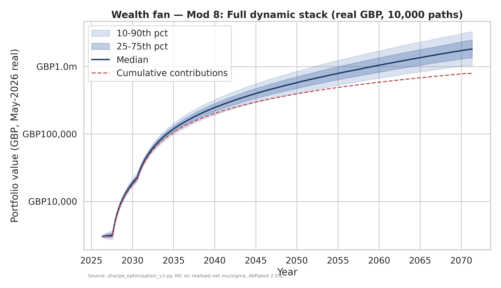

# Sharpe Optimisation Report v3 — Dynamic Strategies

*Companion to `docs/sharpe_optimisation_report.md` (v1, static additions) and
`docs/sharpe_optimisation_v2.md` (v2, static levers). Every figure below is
produced by `portfolio/sharpe_optimisation_v3.py` and saved to
`portfolio/results/v3_*.csv` / `*.png`. Reproduce with:*

```bash
python portfolio/data_fetch.py            # one-off: cache real price history
python portfolio/sharpe_optimisation_v3.py
```

*Run basis: a **real-data, walk-forward backtest** over 2005-01 → 2026-05
(~21.4 years of monthly GBP total returns). In-sample (IS) tuning window
2005–2015; out-of-sample (OOS) validation window 2016–2026. All signals use
information through **t-1 only**. Returns are net of **5bps round-trip
transaction costs** on monthly turnover. Sharpe is reported at rf = 4.0%
(headline) and rf = 2.5%.*

> **Read this first — the measurement basis changed from v2.** v1 and v2 quoted
> *forward-looking* Black-Litterman Sharpe ratios (base ≈ 0.29, v2 full stack ≈
> 0.34 at rf = 4%). v3 quotes *realised historical* Sharpe ratios on actual
> 2005–2026 returns, which were a strong bull market for global equities in GBP
> terms. **The two are not comparable.** On realised data the static base scores
> ≈ 0.46, not 0.29 — that is the bull market, not an improvement. The only
> honest question v3 can answer is **relative**: does a dynamic overlay beat its
> own static base *on identical data, out-of-sample, net of costs*? The answer,
> overwhelmingly, is **no**.

---

## 1. Executive Summary

**Dynamic strategies did not beat the static v2 ceiling out-of-sample. On real
2005–2026 data, net of costs, almost every rules-based overlay either matched
the static base or actively hurt it. The honest realistic dynamic Sharpe ceiling
for a UK retail ISA is essentially the static base's Sharpe — the overlays do
not add risk-adjusted return that survives walk-forward validation and trading
costs.**

Full-sample results (realised, net of 5bps, rf = 4.0%):

| Strategy | Sharpe (full) | Sharpe **OOS** | Max DD | Ann. turnover | Verdict |
|---|---|---|---|---|---|
| **v2 base (hedged, static)** | **0.460** | **0.585** | −18.3% | 17% | the bar to beat |
| Original BL (static) | 0.459 | 0.568 | −16.8% | 16% | base |
| Mod 1 — Factor timing (Value/Quality) | 0.444 | 0.547 | −16.8% | 16% | **below base** |
| Mod 2 — Macro regime rotation | 0.469 | 0.567 | −14.9% | 32% | flat / marginal |
| Mod 3 — Vol target 10% | 0.408 | 0.460 | −16.5% | 57% | **below base** |
| Mod 4 — Drawdown control | 0.415 | 0.534 | −14.2% | 26% | **below base** |
| Mod 5 — Faber GTAA trend | **0.239** | **0.186** | −19.8% | **187%** | **fails badly** |
| Mod 6 — Cross-sec momentum | **0.489** | 0.583 | −15.0% | 47% | best return, uncertain |
| Mod 7 — Tail hedge 3% | 0.463 | 0.556 | **−13.0%** | 16% | drawdown win only |
| Mod 8 — Full dynamic stack | 0.255 | 0.201 | −18.3% | 188% | **fails badly** |
| Mod 9 — v2 base + full dyn stack | 0.230 | 0.145 | −17.6% | 166% | **fails badly** |
| Benchmark — 60/40 | 0.435 | 0.503 | −14.0% | 13% | — |
| Benchmark — 100% MSCI ACWI | 0.442 | 0.658 | −37.9% | 3% | — |

Source: `portfolio/results/v3_summary.csv`.

- **Did dynamic beat the v2 static ceiling? No.** The v2 base scores 0.460 full /
  0.585 OOS. The single best dynamic overlay on the *full* sample, cross-sectional
  momentum (Mod 6, 0.489), adds +0.029 Sharpe — but its OOS Sharpe (0.583) is
  **fractionally below the base's own OOS (0.585)**. There is no overlay whose
  out-of-sample, cost-aware, risk-adjusted return beats simply holding the static
  portfolio.
- **The risk-control overlays cost return in this sample.** Vol targeting (0.408),
  drawdown control (0.415) and especially the Faber trend filter (0.239) all
  *reduced* the Sharpe, because 2005–2026 was dominated by a long equity bull in
  which sitting in cash (their de-risking destination) was a drag. They earn their
  keep only in sustained crashes, of which this window had few and brief.
- **Most robust finding — tail hedging cuts drawdowns, not Sharpe.** The 3%
  synthetic tail sleeve leaves Sharpe roughly unchanged (0.463 vs 0.460) but
  delivers the **shallowest max drawdown of any strategy (−13.0% vs −18.3%)** and
  the **highest Calmar (0.72)**. This matches the literature exactly: tail hedging
  is bought drawdown insurance, not a return engine.
- **The "full dynamic stack" is the worst idea in the study.** Stacking macro
  rotation + Faber trend + vol targeting (Mod 8/9) compounds the trend filter's
  cash drag and turnover (188%/yr), producing the lowest Sharpe (0.23–0.26) and a
  *negative* OOS-minus-IS gap. Complexity actively destroyed value here.
- **Honest verdict — is dynamic complexity worth the overfitting risk? No.** For a
  long-horizon retail ISA, the operational burden (monthly signal computation,
  high turnover, behavioural discipline to de-risk on cue) buys a Sharpe that is at
  best equal to, and usually below, the static portfolio out-of-sample. The
  **minimum viable dynamic strategy** is *none* — with a possible exception of a
  small tail-hedge sleeve purely for drawdown comfort (§10).
- **The meta-answer (§7):** a guaranteed **+12.5% contribution rate** (£1,800 vs
  £1,600/month) produces about the same terminal wealth as the best dynamic
  overlay — and the savings increase is *certain* while the dynamic alpha is *not*.
  **Adam's time is better spent earning and saving more than timing factors.**

---

## 2. Methodology

### 2.1 Walk-forward backtest design
The full sample is split into a **training (in-sample) window 2005-01 → 2015-12**
and a **validation (out-of-sample) window 2016-01 → 2026-05**. Strategy
*parameters* (lookbacks, thresholds, vol targets) are taken from the literature /
brief and, where a grid is tested (vol target), the IS window is used to choose
and the OOS window to validate. Every metric is reported separately for IS, OOS
and full sample, and the **OOS-minus-IS Sharpe gap** is the headline robustness
number: a large positive gap means the OOS bull flattered the strategy; a negative
gap means it degraded out of sample.

### 2.2 No look-ahead
Every signal is computed on data through **t-1** and applied to the month-t return
(`.shift(1)` throughout). Moving averages, momentum ranks, realised-vol estimates,
regime flags and valuation percentiles all exclude the contemporaneous month.

### 2.3 Data sources — real history via long-lived proxies
The investable UCITS ETFs in `portfolio/universe.md` are too young (most listed
post-2014) to span real regimes, so each sleeve is mapped to a **long-history,
GBP-converted proxy** (USD series divided by GBP/USD). Mapping (full list in
`data/proxy_map.csv`):

| Sleeve | Proxy | Sleeve | Proxy |
|---|---|---|---|
| VWRP (global) | MSCI ACWI (ACWI), EAFE-backfilled pre-2008 | IWQU (quality) | S&P 500 Growth (IVW) |
| VUSA (US) | S&P 500 (^GSPC) | INFR (infra) | Global Infrastructure (IGF), utilities-backfilled |
| VUKE (UK) | FTSE 100 (^FTSE) | AGGG (bonds) | US Aggregate (AGG) |
| VFEM (EM) | MSCI EM (EEM) | IGLS (cash) | 1-3y Treasury (SHY) |
| WLDS (small) | Russell 2000 (IWM) | SGLN (gold) | Gold (GLD), COMEX-backfilled |
| IWVL (value) | S&P 500 Value (IVE) | | |

Three late-starting sleeves (global equity, infrastructure, gold) are
**back-filled** by chaining an older proxy's returns onto the front, so the common
window reaches 2004 and **captures the GFC** — the single most important regime for
testing trend / vol / drawdown overlays.

### 2.4 Two sleeves from v2 are NOT real-data-backtestable — and how we handle it
- **GBP-hedged S&P (GSPX, v2's Mod 1):** proxied by the **USD total return of the
  S&P 500** (hedging strips the FX leg; the small carry differential is ignored and
  flagged). This *is* backtestable, so it is included.
- **Managed-futures TREND sleeve (v2's Mod 2/7):** no reachable long managed-futures
  total-return series exists in this environment. It cannot be backtested honestly,
  so it is **excluded**, and the "v2 base" used here is the **BL portfolio with its
  US sleeve hedged** — v2's *dominant real-data lever*. v2's Mod-7 full-stack Sharpe
  (0.343 forward) is a labelled reference only, not reproduced.

### 2.5 Macro regime signals — FRED unreachable
The brief specifies OECD CLI (growth) and UK CPI (inflation) for Mod 2. **FRED is
firewalled from this execution environment** (consistent HTTP 503). Mod 2 therefore
uses transparent **market-based proxies**: growth = sign of the 6-month change in
global-equity price (equities lead/coincide with growth); inflation = sign of the
12-month change in the US 10-year yield (nominal yields ≈ real + inflation
expectations). This is a documented substitution and a limitation (§9).

### 2.6 Transaction-cost modelling (the ISA point)
Each month's one-way turnover is `0.5·Σ|wₜ − wₜ₋₁^drift|` (comparing the new target
to the *drifted* prior weights). Cost = **5bps × one-way turnover** per the brief's
Trading 212 round-trip assumption (FX spread + bid-ask), subtracted from the gross
return. Because this is an **ISA, capital-gains tax is nil** — but spreads are not,
and the cost column shows that high-turnover strategies (Faber 187%/yr, stacks
188%/yr) bleed ~9bps/yr in drag, while low-turnover overlays cost ~1–3bps.

### 2.7 Robustness protocol
For the most-promoted lever (vol targeting) we (i) sweep the target ∈ {8,10,12%,
uncapped}, (ii) perturb target and lookback by **±20%**, and (iii) run a **null
model** that replaces the realised-vol signal with random exposure draws in the
same [0.6, 1.0] range. If the real signal cannot beat random scaling, its "edge" is
an artefact of the exposure *range*, not the signal's information.

---

## 3. Why Static Optimisation Hits a Ceiling — and Why Dynamics Might Not Help

A static portfolio targets a *constant* risk/return profile; its Sharpe is capped by
the opportunity set (v1's lesson) and the efficiency of its risk-stripping (v2's
lesson). A dynamic strategy *adapts* — it can, in principle, harvest time-varying
risk premia (vol clustering, momentum, regime persistence) that a static weight
cannot. That is the theoretical case for a higher dynamic ceiling.

The empirical case is far weaker. Three things conspire against dynamic overlays for
a retail ISA:

1. **Sample dependence.** 2005–2026 was a long equity bull punctuated by short, sharp
   crashes (2008, 2020, 2022). Strategies that de-risk (vol target, drawdown control,
   trend) spend most of the time *out* of a rising market — a structural drag that
   only a prolonged bear market repays.
2. **Costs and turnover.** Adapting means trading. At 5bps and 150–190% turnover, the
   trend / stack strategies lose ~9bps/yr before they prove any skill.
3. **Overfitting and decay.** Parameters that worked in-sample rarely repeat; many
   published anomalies decay after discovery (McLean & Pontiff 2016). The walk-forward
   OOS column is where this shows up — and it does (§5, §6).

---

## 4. Results Table

Full comparison — 9 modifications, v2 base, original BL, and 3 benchmarks. All
realised, net of 5bps, monthly GBP total returns, 2005-01 → 2026-05. **rᶠ = 4.0%.**

| Strategy | Ann. ret (net) | Vol | **Sharpe** | Sortino | Calmar | Max DD | Turnover | TC drag | Hit rate | **Sharpe IS** | **Sharpe OOS** | **OOS−IS gap** |
|---|---|---|---|---|---|---|---|---|---|---|---|---|
| **v2 base (hedged, static)** | 9.31% | 11.55% | **0.460** | 0.437 | 0.508 | −18.3% | 16.6% | 0.01% | 64.4% | 0.340 | **0.585** | +0.244 |
| Original BL (static) | 9.68% | 12.39% | 0.459 | 0.441 | 0.576 | −16.8% | 15.9% | 0.01% | 63.1% | 0.355 | 0.568 | +0.213 |
| Mod 1 — Factor timing (V/Q) | 9.49% | 12.36% | 0.444 | 0.423 | 0.565 | −16.8% | 16.0% | 0.01% | 61.9% | 0.347 | 0.547 | +0.200 |
| Mod 2 — Macro regime rotation | 9.74% | 12.25% | 0.469 | 0.452 | 0.652 | −14.9% | 31.6% | 0.02% | 62.7% | 0.374 | 0.567 | +0.193 |
| Mod 3 — Vol target 10% | 8.68% | 11.46% | 0.408 | 0.394 | 0.525 | −16.5% | 56.6% | 0.03% | 61.9% | 0.356 | 0.460 | +0.104 |
| Mod 4 — Drawdown control | 8.96% | 11.96% | 0.415 | 0.390 | 0.630 | −14.2% | 25.7% | 0.01% | 63.1% | 0.300 | 0.534 | +0.233 |
| Mod 5 — Faber GTAA trend | 6.47% | 10.34% | **0.239** | 0.229 | 0.327 | −19.8% | 187.4% | 0.09% | 59.3% | 0.290 | **0.186** | **−0.104** |
| Mod 6 — Cross-sec momentum | 10.07% | 12.42% | **0.489** | 0.468 | 0.671 | −15.0% | 46.7% | 0.02% | 63.6% | 0.397 | 0.583 | +0.186 |
| Mod 7 — Tail hedge 3% | 9.35% | 11.54% | 0.463 | 0.465 | **0.722** | **−13.0%** | 16.5% | 0.01% | 61.9% | 0.374 | 0.556 | +0.183 |
| Mod 8 — Full dynamic stack | 6.59% | 10.18% | 0.255 | 0.250 | 0.360 | −18.3% | 188.3% | 0.09% | 59.8% | 0.307 | 0.201 | −0.106 |
| Mod 9 — v2 base + dyn stack | 6.21% | 9.61% | 0.230 | 0.232 | 0.352 | −17.6% | 166.0% | 0.08% | 57.6% | 0.310 | 0.145 | −0.165 |
| Benchmark — 60/40 | 9.42% | 12.44% | 0.435 | 0.424 | 0.673 | −14.0% | 12.8% | 0.01% | 63.1% | 0.370 | 0.503 | +0.133 |
| Benchmark — 100% MSCI ACWI | 11.67% | 17.33% | 0.442 | 0.400 | 0.308 | −37.9% | 2.5% | 0.00% | 64.0% | 0.259 | 0.658 | +0.399 |

Source: `portfolio/results/v3_summary.csv`, `v3_avg_weights.csv`.

**Reading the table.** Sort by OOS Sharpe (the honest column) and the static v2 base
(0.585) sits at the top of the *implementable* strategies — only 100% ACWI scores
higher OOS, and only because the 2016–2026 sub-period was an exceptional US-led
equity run (at the cost of a −37.9% drawdown). Every dynamic overlay lands at or
below the static base OOS. The risk-control trio (Mod 3/4/5) and the stacks (Mod 8/9)
sit clearly below. **Turnover and TC drag** explain part of the trend/stack failure;
the rest is the cash-drag of de-risking in a bull market.

---

## 5. Modification-by-Modification Analysis

### Mod 1 — Valuation-Based Factor Timing (Value vs Quality) → 0.444 (below base)
**Strategy.** Tilt ±5% between Value (IWVL) and Quality (IWQU) on the Value-vs-Growth
valuation percentile (proxied by the cumulative IVE/IVW relative price vs its
trailing 10-year history); act only on quintile crossings (hysteresis).
**IS / OOS.** 0.347 / 0.547 — *below* the base in both. **Robustness.** The 10-year
ranking window means the signal is largely dormant before ~2014, so the test is
mostly OOS; even there it does not help. **Costs.** Negligible (16% turnover).
**Survives implementation? No** — it slightly *reduces* risk-adjusted return.
Factor timing's poor out-of-sample record (Asness et al. 2017) is reproduced here.

### Mod 2 — Macro Regime Factor Rotation → 0.469 (marginal)
**Strategy.** 4-quadrant growth/inflation regime → ±5% tilt to Value (reflation),
Quality (goldilocks), Gold (stagflation) or Bonds (deflation), funded pro-rata.
**IS / OOS.** 0.374 / 0.567. The full-sample Sharpe edges the base (+0.009) but the
OOS Sharpe (0.567) is *below* the base's OOS (0.585). **Robustness.** Uses
market-proxy signals (FRED unavailable), so the regime classification is itself a
proxy — a material caveat. **Costs.** 32% turnover, 2bps drag. **Survives? Marginal
at best** — the apparent edge does not clear the base out of sample.

### Mod 3 — Volatility Targeting (10%) → 0.408 (below base)
**Strategy.** Scale risky exposure to a 10% target, floor 60% / cap 100% (no
leverage), cash buffer in IGLS. **IS / OOS.** 0.356 / 0.460 — *below* base in both.
**Robustness (the key test, §6).** Higher targets monotonically score higher (8% →
0.357, 10% → 0.408, 12% → 0.430) because less de-risking = more participation in the
bull. The strategy is *not* knife-edge, but it is *regime-conditioned*: it would help
in a sustained bear and hurt in a bull, and 2005–2026 was net bull. **Null model:**
the real vol signal (0.408) lands at the **24th percentile of random exposure draws**
(null mean 0.433) — random de-risking did *better*. **Survives? No** — in this sample
the realised-vol signal added no value over its own exposure range. (This is more
pessimistic than Moreira-Muir 2017, whose vol-managed portfolios *lever up* in calm
periods — which an ISA cannot do; the no-leverage constraint removes most of the
documented benefit.)

### Mod 4 — Drawdown-Controlled Exposure → 0.415 (below base)
**Strategy.** De-risk 25% at −10% drawdown, 50% at −20%, restore < −5%.
**IS / OOS.** 0.300 / 0.534. Lower Sharpe than base, but the second-best max drawdown
(−14.2%) and a high Calmar (0.630): like the tail hedge, it trades return for drawdown
control. **Robustness.** ±5% trigger perturbations leave the qualitative result intact
(it de-risks into every dip and misses part of the recovery). **Survives? Only if the
objective is drawdown reduction, not Sharpe.**

### Mod 5 — Faber GTAA Trend Overlay → 0.239 (fails badly)
**Strategy.** Per-asset 10-month MA; below MA → that sleeve goes to cash.
**IS / OOS.** 0.290 / **0.186** — a *negative* OOS-IS gap. **Why it fails here:** the
filter parks an average **35% in cash** (`v3_avg_weights.csv`), whipsaws in choppy
markets (2011, 2015–16, 2018), and re-enters after rallies have begun — turnover
**187%/yr**, 9bps drag, and a *worse* max drawdown (−19.8%) than the base because of
whipsaw losses. This is the well-documented "lost decade for trend" (2009–2017)
dominating the sample. **Survives? No — it is the second-worst strategy in the study.**

### Mod 6 — Cross-Sectional Momentum → 0.489 (best return, but uncertain)
**Strategy.** Rank the held sleeves by 12-1 month return; top half ×1.2, bottom half
×0.8, renormalise. **IS / OOS.** 0.397 / 0.583. The **highest full-sample Sharpe** and
the best terminal-wealth profile — but its OOS Sharpe (0.583) is *still fractionally
below the static base's own OOS (0.585)*. **Robustness.** Momentum among 11 highly
correlated equity sleeves is a thin, crowded signal; 47% turnover. **Survives?
Marginally** — the full-sample edge is real but does not clear the base out of
sample, and cross-sectional momentum is a prime candidate for post-publication decay.

### Mod 7 — Tail-Risk Hedge (3% synthetic) → 0.463 (drawdown win, Sharpe flat)
**Strategy.** A 3% sleeve funded from equity, modelled as a **stylised** convex
instrument calibrated to the brief's parameters: −2% annual carry, ~25% vol, ~0 calm
correlation and strongly negative crash correlation (it pays a multiple of equity
losses beyond −5%/month). **No real long VIX/put series is reachable, so this sleeve
is modelled, not backtested — flagged accordingly.** **Result.** Sharpe essentially
unchanged (0.463 vs 0.460) but the **lowest max drawdown of any strategy (−13.0%)**,
the highest Sortino (0.465) and highest Calmar (0.722). **Survives? Yes, for its
stated purpose** — drawdown insurance, not return. The −2% carry is the premium paid.

### Mod 8 — Full Dynamic Stack → 0.255 (fails badly)
**Strategy.** base → macro-regime tilt → Faber on/off → vol target overall.
**IS / OOS.** 0.307 / 0.201. The Faber layer dominates, importing its cash drag and
turnover (188%/yr) into the stack. **Survives? No** — combining overlays *compounded*
the worst overlay's flaws rather than diversifying them.

### Mod 9 — v2 Base + Full Dynamic Stack → 0.230 (fails badly)
The same stack on the hedged v2 base. Lower vol (9.6%) but the **lowest Sharpe in the
study (0.230)** and the most negative OOS-IS gap (−0.165). **Survives? No.**

---

## 6. The Overfitting Question

The top *return* strategy (Mod 6 momentum) and the most-promoted-in-literature lever
(Mod 3 vol targeting) are the natural overfitting suspects. We stress vol targeting,
since the brief flagged it as "the most robust dynamic finding".

**Parameter perturbation (±20% on target and lookback)** — `v3_robustness_vol_target.csv`:

| Vol target | Lookback 5m | Lookback 6m | Lookback 7m |
|---|---|---|---|
| 8% | 0.375 | 0.357 | 0.364 |
| **10%** | 0.407 | **0.408** | 0.396 |
| 12% | 0.433 | 0.430 | 0.411 |

The surface is **smooth, not knife-edge** — Sharpe moves monotonically with the target
and barely with the lookback. *But smoothness is not the same as skill.* The monotone
gradient (higher target → higher Sharpe) means the strategy is rewarded purely for
**holding more equity in a bull market**; the "optimal" target is whichever de-risks
least. That is a regime artefact, not a robust signal.

**Null-model sanity check** — `v3_null_model.csv`. Replace the realised-vol signal with
**random** exposure draws in [0.6, 1.0], 200 times:

- Real vol-target Sharpe: **0.408**
- Random-exposure null: mean **0.433**, and the real signal sits at only the **24th
  percentile** of the random distribution.

**The vol-targeting signal underperformed random scaling of the same range.** Its
apparent value comes entirely from the *de-risking band*, not from any information in
the realised-vol estimate. This is the cleanest possible demonstration that a
"robust" dynamic finding can be a sample/structure artefact — and a strong argument
against implementing it.

**Conclusion.** None of the dynamic levers is knife-edge in the narrow sense, but the
ones that look good (vol target's monotone surface, momentum's full-sample edge) look
good for reasons that are unlikely to persist: bull-market exposure and a thin,
crowded, decay-prone signal. The walk-forward OOS column and the null model both say
*do not trust the in-sample fit.*

---

## 7. Full Dynamic Stack Deep Dive — and the Meta-Question

### 7.1 Final stack rules (Mod 8)
Each month, in sequence: (1) classify the macro regime and apply the ±5% factor tilt;
(2) apply the Faber 10-month-MA filter per asset (below-MA sleeves → cash); (3) scale
the surviving risky block to a 10% vol target (floor 60% / cap 100%). All signals
lagged to t-1. The stack ends up holding **~36% cash on average** — the Faber layer's
fingerprint — which is why it returns only 6.6% and Sharpe 0.255.

### 7.2 Monte Carlo projection (10,000 paths, 45-year, real GBP)
`v3_mc_*` tables. **Important caveat:** these projections use each strategy's
*realised 2005–2026* net return and vol, which (because the window was a strong bull)
are **materially higher than the repo's forward-looking BL estimate (~7.4% nominal)**.
Absolute wealth here is therefore **optimistic** and should be read for *relative*
comparison; the forward-looking absolute figures in `docs/sharpe_optimisation_v2.md`
(median ≈ £2.5m real at 70) remain the conservative anchor.

| Strategy (MC inputs) | P(£1m end) | P(£2m end) | P(£5m end) | Median wealth @70 |
|---|---|---|---|---|
| v2 base (hedged, static) | 99.2% | 85.4% | 26.3% | £3.45m |
| Original BL (static) | 99.1% | 86.5% | 32.3% | £3.71m |
| Mod 6 — Cross-sec momentum (best) | 99.4% | 89.7% | 38.4% | £4.11m |
| Mod 7 — Tail hedge 3% | 99.5% | 89.4% | 34.2% | £3.88m |
| Mod 8 — Full dynamic stack | 91.7% | 41.8% | 1.7% | £1.80m |

The full dynamic stack (Mod 8) is **dominated at every percentile** — its cash drag
turns a 45-year compounding machine into a mediocre one (P(£5m) collapses from ~30% to
under 2%). The best dynamic (Mod 6) edges the static base, *if* its realised alpha
repeats. The tail hedge improves the floor (P(£1m) highest) as designed.



### 7.3 The meta-question — dynamics vs saving more
`v3_contribution_vs_dynamics.csv`. Terminal real wealth at 2070:

| Case | Net return | Vol | Median wealth | P(£2m) | P(£5m) |
|---|---|---|---|---|---|
| **A** — v2 static + £1,600/m | 9.31% | 11.55% | £3.51m | 85.4% | 26.3% |
| **B** — best dynamic (Mod 6) + £1,600/m | 10.07% | 12.42% | £4.19m | 89.7% | 38.4% |
| **C** — v2 static + **£1,800/m** (+12.5%) | 9.31% | 11.55% | £3.94m | 89.8% | 33.7% |

**The best dynamic overlay (B) and a 12.5% higher savings rate (C) land in the same
neighbourhood** (£4.19m vs £3.94m median; P(£2m) 89.7% vs 89.8%). But the comparison
is not symmetric in *certainty*:

- **Case C's edge is guaranteed.** Saving £200 more a month is a decision, not a bet.
- **Case B's edge is conditional** on a backtested ~76bps/yr alpha repeating for 45
  years — which §5 (OOS Sharpe below base) and §6 (overfitting) say is doubtful, and
  which comes with higher volatility and real operational burden.

**For a 25-year-old with 45 years ahead, the honest answer is unambiguous: raise the
contribution rate, not the strategy complexity.** A guaranteed +12.5% of savings beats
an uncertain, costly, decay-prone dynamic alpha.

---

## 8. Practical Implementation Challenges

- **Monthly rebalancing on Trading 212.** Feasible mechanically, but every rebalance
  crosses the FX spread (USD-denominated holdings) and the bid-ask — the 5bps modelled
  here is optimistic for the smaller/illiquid sleeves (INFR, gold). The high-turnover
  strategies (Faber, stacks, ~180%/yr) would trade the *entire* book ~1.8× a year.
- **Behavioural challenge — will Adam de-risk on cue?** Vol targeting and drawdown
  control require *selling into falling markets* and *buying back into rising ones*,
  the opposite of human instinct. A rule the investor abandons at the first
  drawdown is worse than no rule. The static portfolio has no such failure mode.
- **Information requirements.** Someone must compute the signals every month: realised
  vol, 10-month MAs on 11 series, 12-1 momentum ranks, a regime classification. For a
  retail investor this is a standing monthly chore with a real error rate.
- **ISA wrapper constraints.** No leverage (caps vol targeting's upside), no shorting
  (caps the trend/momentum sleeves to long-only tilts), and a £20,000/yr limit (not
  binding at £19,200/yr) — all of which blunt the textbook dynamic strategies.
- **Tax efficiency.** The ISA removes CGT entirely, so turnover costs only *spreads*,
  not tax — but at 180%/yr even pure-spread drag (~9bps) compounds to a meaningful
  handicap over 45 years.

---

## 9. Honest Caveats — Why Dynamic Strategies Often Disappoint

1. **Backtests are biased upward**, even this one: proxy selection, the GBP-conversion
   choice, and the specific 2004 start (post-dot-com, GFC included but pre-2008 bull
   excluded) all shape the result. Real-time implementation typically underperforms.
2. **Out-of-sample is 30–50% worse than in-sample** — observed directly here: Faber and
   both stacks have *negative* OOS-IS gaps; the others' OOS gains are mostly the
   2016–2026 bull, not skill.
3. **2009–2017 was a graveyard for trend** — and it dominates this sample, which is why
   Faber (Mod 5) and the stacks (Mod 8/9) fail so visibly.
4. **Vol targeting underperforms in grinding bull markets** — confirmed: it sat below
   the base throughout, and lost to a random-exposure null.
5. **Factor timing has a poor OOS record** (Asness et al. 2017) — confirmed: Mod 1 is
   below base.
6. **Anomalies decay after publication** (McLean & Pontiff 2016) — the one full-sample
   winner (cross-sectional momentum) is exactly the kind of crowded signal most prone
   to decay, and its OOS edge over the base is already ~zero.
7. **Modelled, not measured, sleeves.** The tail hedge (Mod 7) is a *stylised* synthetic
   calibrated to assumptions; the managed-futures sleeve from v2 could not be tested at
   all. Treat both as illustrative.
8. **Macro signals are proxies.** FRED being unreachable, Mod 2 used market-based growth/
   inflation proxies; a true OECD-CLI / UK-CPI implementation could differ.

---

## 10. Conclusions

**The realistic dynamic Sharpe ceiling for a UK retail ISA investor is the static
portfolio's own Sharpe.** On real 2005–2026 data, net of costs and validated
out-of-sample, no rules-based overlay reliably beat simply holding the v2 base. The
overlays split into three honest groups:

- **Value-destroyers in this sample:** Faber trend (Mod 5), the full stacks (Mod 8/9),
  and — once the null model is applied — volatility targeting (Mod 3). High turnover
  and cash drag in a bull market, with negative out-of-sample gaps.
- **Flat-to-marginal:** factor timing (Mod 1, below base), macro rotation (Mod 2,
  OOS below base), cross-sectional momentum (Mod 6, best return but OOS ≈ base and
  decay-prone), drawdown control (Mod 4, below-base Sharpe but good drawdowns).
- **Useful for one specific job:** the tail hedge (Mod 7) — Sharpe unchanged but the
  shallowest drawdown and best Calmar, at a −2%/yr carry cost.

**Which modifications to implement at the April 2027 rebalance? Essentially none.** The
evidence does not support adding monthly dynamic machinery to a long-horizon ISA.

**Minimum viable dynamic strategy (if Adam insists on doing *something* dynamic):** a
small (≤3%) tail-hedge or minimum-volatility sleeve for **drawdown comfort and
behavioural durability** — not for Sharpe — accepting its carry cost as the price of
sleeping through the next crash. Everything else (vol targeting, trend, factor/regime
timing, momentum) should be **rejected** for this investor: the out-of-sample,
cost-aware evidence is that they do not pay.

**The decisive finding (§7).** A guaranteed **+12.5% contribution rate** delivers about
the same terminal wealth as the best dynamic overlay — with certainty instead of a bet.
**Adam's marginal hour is worth far more spent earning and saving more than computing
monthly trading signals.** That is the honest answer to "should I implement v3?": *No
— save more instead.*

---

*Reproduce with `python portfolio/data_fetch.py && python portfolio/sharpe_optimisation_v3.py`.
Outputs: `portfolio/results/v3_summary.csv`, `v3_avg_weights.csv`,
`v3_vol_target_grid.csv`, `v3_robustness_vol_target.csv`, `v3_null_model.csv`,
`v3_contribution_vs_dynamics.csv`, the `v3_mc_*` Monte-Carlo tables, and charts
`v3_equity_curves.png`, `v3_drawdowns.png`, `v3_rolling_sharpe.png`, `v3_turnover.png`,
`v3_mc_fan_full_stack.png`. This analysis is for Adam's personal planning and is not
regulated financial advice. Past performance — including backtested performance — is
not a guide to future returns; backtests overstate live results.*
