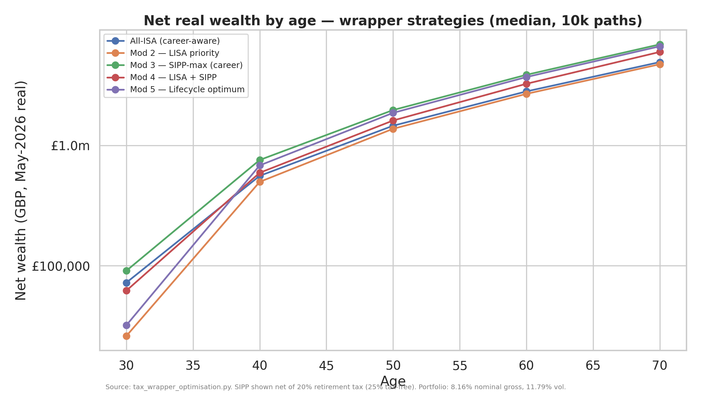
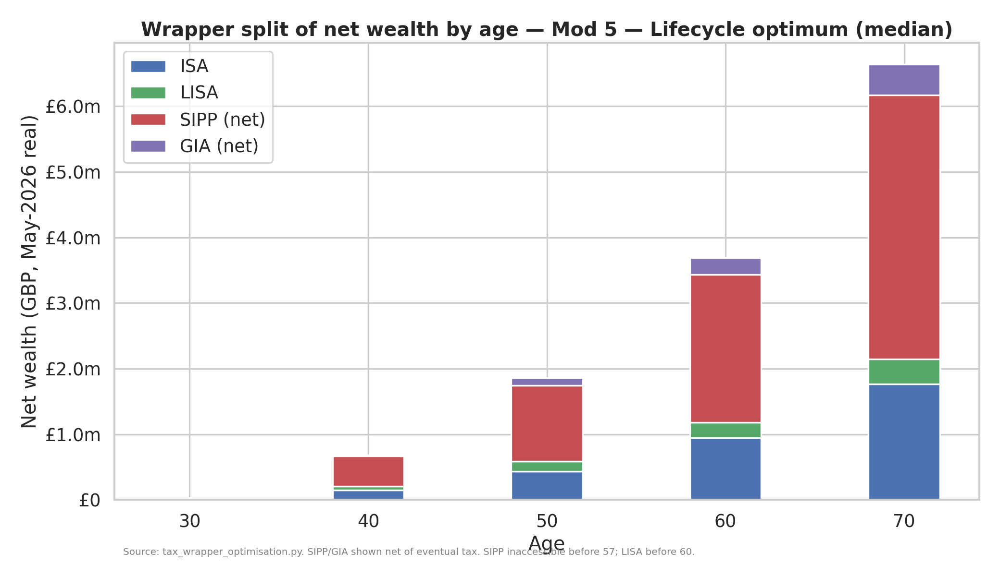
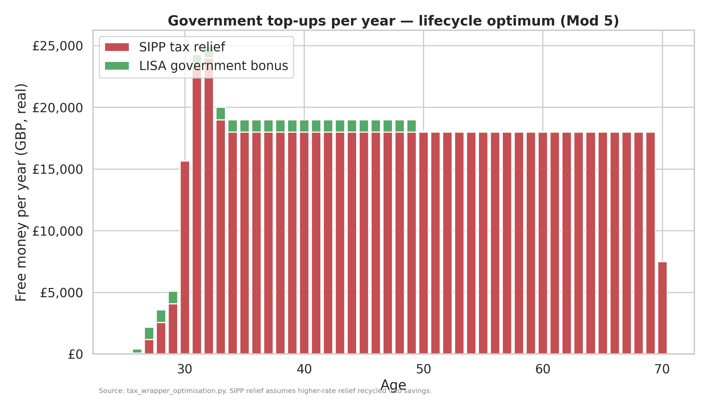

# Tax Wrapper Optimisation — Where Should Each Pound Go?

*Companion to `docs/sharpe_optimisation_v2.md` (portfolio levers) and
`docs/sharpe_optimisation_v3.md` (dynamic strategies + the "save more" meta-finding).
Every figure below is produced by `portfolio/tax_wrapper_optimisation.py` and saved to
`portfolio/results/v4_*.csv` / `*.png`. Reproduce with:*

```bash
python portfolio/tax_wrapper_optimisation.py
```

*Run basis: the portfolio is held **constant** at v2's BL-with-hedged-US sleeve —
**8.16% nominal gross E[r], 0.24% TER (→ 7.92% net), 11.79% volatility**, deflated at
2.5% inflation to ~5.29% real. v4 changes only the **wrapper allocation** of a
career-aware saving stream. Tax rules are **2026/27**, verified by web search in May 2026
(sources in §13); every date-sensitive assumption is flagged. 10,000 Monte-Carlo paths,
common random numbers across variants so differences are pure wrapper effects.*

> **Read this first — the question changed.** v1–v3 asked *"what should Adam hold?"* and
> concluded the realistic Sharpe ceiling is ~0.34 and that dynamic overlays don't beat a
> static portfolio out-of-sample. v4 asks *"which account should he hold it in?"* — and the
> answer turns out to **dwarf** every portfolio decision in v1–v3. Wrapper choice is worth
> **+35% to +44% of terminal real wealth** at the same saving rate, versus the ~+19% from
> v2's full portfolio stack and the ~+12% from v3's "save 12.5% more". **The biggest free
> lunch in this entire project is statutory, not financial: higher-rate pension tax relief.**

---

## 1. Executive Summary

**Which wrapper strategy maximises terminal real wealth? A SIPP-led lifecycle plan that
still funds a house deposit — Mod 5 — at a median £6.73m real at age 70, versus £4.67m for
an all-ISA saver who also buys a house. That is +£2.06m (+44%) for the same take-home
saving, almost entirely from pension tax relief Adam is leaving on the table today.**

| Strategy | Terminal real wealth @70 (p50) | vs all-ISA¹ | House at 30? | Accessible pre-57 |
|---|---|---|---|---|
| Status quo (£1,600/m, all-ISA) | £2.71m | (different saving) | yes (99.9%) | 100% |
| All-ISA (career-aware) | £4.99m | baseline | no purchase | 100% |
| All-ISA + house | £4.67m | baseline (house) | yes (99.9%) | 100% |
| Mod 2 — LISA priority | £4.77m | **+2.3%** | yes (100%) | 88% |
| Mod 3 — SIPP-max | £7.00m | **+40.3%** | **NO (0%)** | 38% |
| Mod 4 — LISA + SIPP (+ mortgage) | £6.05m | **+29.7%** | yes (100%) | 30% |
| **Mod 5 — Lifecycle optimum** | **£6.73m** | **+44.1%** | **yes (94.7%)** | 30% |

¹ Mod 2/4/5 vs "All-ISA + house"; Mod 3 vs "All-ISA (career-aware)" because Mod 3 buys no house.

- **How big is the wrapper choice vs the portfolio choice?** It is the **largest single lever
  in the whole project.** v2's best *portfolio* stack lifted median terminal wealth ~19%
  (£2.12m → £2.52m on the old £1,600/m plan); v3 showed a +12.5% saving rate adds ~12%. v4's
  wrapper optimisation adds **+44%** at the *same* saving — and unlike a Sharpe improvement or
  a backtested alpha, **it is guaranteed by tax statute, not earned in markets.** Expressed as
  an equivalent return it is worth roughly **+0.8%/yr** compounded over 44 years (more for
  early pounds) — but certain.
- **The practical recommendation by career phase:**
  - **Phase 1 — basic-rate / internship (now → first higher-rate year):** ISA and LISA first.
    A basic-rate SIPP is only 6% better than an ISA and locks the money for 30+ years — not
    worth it. **Open a LISA now** (the single most time-sensitive action — see §9).
  - **Phase 2 — higher rate (40%, ≈ £50k–£100k):** **SIPP becomes the priority.** Every £1 of
    take-home put in a SIPP is worth £1.42 at retirement (25% tax-free + 20% drawdown rate)
    versus £1.00 in an ISA. Fill SIPP to ~£20k gross/yr, then ISA, then LISA, GIA last.
  - **Phase 3 — the £100k–£125k personal-allowance trap (60% marginal):** **SIPP is
    extraordinary here — £1 of take-home becomes £2.13.** Maximise SIPP through this band.
    Above £125k (45% additional rate) the multiplier is still 1.55. ISA and LISA fill the
    pre-57 access bridge; GIA absorbs the overflow.
- **The catch the model makes unavoidable:** naive SIPP-maxing (Mod 3) produces the highest
  paper wealth (£7.0m) **but Adam could never buy a house — 0% of paths have £50k accessible
  at age 30**, and only 38% of his wealth is reachable before 57. The lifecycle optimum gives
  up ~£0.27m of terminal wealth to **guarantee the deposit (95% feasible)** and keep an
  accessible bridge. That trade — a few per cent of end wealth for a house and liquidity — is
  the whole point of the exercise.

---

## 2. The Four Wrappers — Current Rules (2026/27)

Verified by web search, May 2026 (§13). Source CSV: `v4_wrapper_rules.csv`.

| Feature | **ISA (S&S)** | **LISA** | **SIPP** | **GIA** |
|---|---|---|---|---|
| Annual limit | £20,000 | £4,000 *(within the ISA £20k)* | £60,000 or 100% of earnings | none |
| Contribution relief | none | **+25% govt bonus** (£1,000/yr) | **marginal rate** (20/40/45%, **60%** in PA taper) | none |
| Growth taxed? | no | no | no | dividends >£500; CGT on gains |
| Withdrawal taxed? | no | no for first home (≤£450k) or 60+ | **25% tax-free, rest at marginal rate** | CGT >£3k exemption (18%/24%) |
| Access | any age | first home or 60+ *(else 25% penalty)* | **57 from Apr-2028** (was 55) | any age |
| Inheritance | spousal ISA protection | as ISA | **enters IHT estate from Apr-2027** | in estate |
| 2026 specifics | cash-ISA restriction mooted Apr-2027 (S&S unaffected) | open 18–39; pay in to 50; £450k cap binds in London | LTA abolished; tax-free lump capped £268,275 | exemptions frozen; dividend rates +2% from Autumn-25 |

**Pending policy changes flagged:** (i) **pensions enter the IHT estate from 6 April 2027** —
confirmed at Autumn Budgets 2024 & 2025; (ii) **minimum pension age rises 55 → 57 on 6 April
2028**; (iii) a cash-ISA reform is mooted for April 2027 but does **not** affect Stocks &
Shares ISAs. SIPP rules have changed materially in each of the last several Budgets — §8
stress-tests the risk that they worsen further.

---

## 3. Adam's Circumstances

| Parameter | Assumption | Note / sensitivity |
|---|---|---|
| Age / domicile | 25, UK, London from mid-2026 | LISA must be opened **before 40** |
| Now | M&G Private Markets summer internship (Jun 2026) | minimal saving; £3,001 ISA already invested |
| Graduate role | M&G, Sep 2027 | salary ramp below |
| Saving rate | **25% of gross income** from the graduate role | funded from take-home |
| Income trajectory (real) | Yr 1 £55k → Yr 4 £80k → Yr 7 £110k → Yr 10 £150k → Yr 15 £200k, flat | ±25% sensitivity (§5) |
| Life event | **first home at age 30, £50k real deposit** | £40k/£50k/£60k scenarios tested |
| Horizon | to age 70 (2071), retirement-oriented | |

> **Honest flag on the salary assumption.** The brief specifies a £55k Year-1 graduate
> salary, but M&G's *publicly advertised* asset-management graduate programme pays roughly
> **£35k–£46k** (Glassdoor / scheme listings, May 2026 — §13). A lower starting salary delays
> the move into the 40% band and weakens the early SIPP case. This is exactly what the **−25%
> income sensitivity** captures (§5): at 0.75× income, terminal wealth falls to £5.36m but the
> SIPP-led ranking is unchanged, because the *order* of wrapper multipliers depends on the
> marginal **rate**, not the income level. Once Adam is a higher-rate taxpayer — whenever that
> happens — the SIPP logic dominates.

**Saving capacity vs the ISA limit — why the wrapper question even arises.** At £55k, 25%
saving = £13,750/yr — comfortably inside the £20k ISA limit, so wrapper choice barely matters.
But by Year 7 (£110k) the saving rate is **£27,500/yr**, and by Year 15 (£200k) it is
**£50,000/yr** — far above £20k. Once saving exceeds the ISA allowance, the money *must* go
somewhere: a SIPP (with relief), a GIA (with tax), or nowhere tax-advantaged. **That overflow
is where the entire £2m swing is won or lost.**

---

## 4. Methodology

### 4.1 The core idea — a per-wrapper terminal multiplier
Because all four wrappers hold the *same* portfolio and grow at the same rate `G`, the wrapper
decision reduces to a **growth-neutral multiplier** on each £1 of take-home saving:

| Wrapper | Net terminal £ per £1 take-home | Why |
|---|---|---|
| ISA | **1.000** | no relief in, no tax out |
| GIA | **< 1.00** | dividend drag (~0.5%/yr) + terminal CGT on gains |
| LISA | **1.250** | +25% bonus in, tax-free out (first home or 60+) |
| SIPP @ 20% relief | **1.063** | 1/0.8 in; 25% tax-free + 75%×(1−20%) out |
| SIPP @ 40% relief | **1.417** | 1/0.6 in; same withdrawal factor 0.85 |
| SIPP @ 45% relief | **1.545** | 1/0.55 in |
| **SIPP @ 60% (PA taper)** | **2.125** | 1/0.4 in — the standout |

SIPP gross-up = `1/(1−m)`; withdrawal factor = `taxfree + (1−taxfree)×(1−ret_rate)` =
`0.25 + 0.75×0.80 = 0.85`. **Maximising terminal wealth is, to first order, just sorting
wrappers by this multiplier** — subject to annual caps and access constraints. The whole
report is an elaboration of that one table.

### 4.2 Tax-relief modelling (the SIPP gross-up)
£1 of take-home directed to a SIPP grosses up to `1/(1−m)` in the pot, where `m` is the
marginal **income-tax** rate. We assume **higher-/additional-rate relief is recycled into
savings** (the standard "true cost" treatment) — if instead the rebate is spent, the
higher-rate multiplier falls toward 1/0.8 and the rest is consumed benefit (flagged in §6).
NI relief is **not** assumed (relief-at-source); salary sacrifice would add ~2–13.8% more and
is noted as an upside in §10.

### 4.3 Marginal-rate determination by income band (2026/27, England)
`income_tax()` / `national_insurance()` implement the verified bands. Marginal income-tax rate
for relief: 0% ≤ £12,570; **20%** to £50,270; **40%** to £100,000; **60%** £100k–£125,140 (the
£1-per-£2 personal-allowance taper); **45%** above. Worked points (`net_income()`):

| Gross | Income tax | Employee NI | Take-home | Marginal | SIPP multiplier |
|---|---|---|---|---|---|
| £25,000 | £2,486 | £994 | £21,520 | 20% | 1.063 |
| £55,000 | £9,432 | £3,111 | £42,457 | 40% | 1.417 |
| £80,000 | £19,432 | £3,611 | £56,957 | 40% | 1.417 |
| £110,000 | £32,432 | £4,211 | £73,357 | **60%** | **2.125** |
| £150,000 | £51,189 | £5,011 | £93,800 | 45% | 1.545 |
| £200,000 | £73,689 | £6,011 | £120,300 | 45% | 1.545 |

### 4.4 Withdrawal modelling
SIPP is valued **net of eventual tax**: 25% tax-free + 75% at an assumed **20% effective
retirement rate** (the brief's assumption — reasonable for a drawdown that uses the personal
allowance and basic-rate band first; sensitivity in §6). ISA and LISA (post-60 or first-home)
are tax-free. GIA bears a ~0.5%/yr dividend drag during accumulation and a terminal CGT of
~20% effective on gains (full higher rate is 24%; phased disposals using the £3k annual
exemption pull the *effective* rate below the headline).

### 4.5 House-purchase modelling
A £50k real deposit is withdrawn at age 30, drawn **LISA-first** (penalty-free for a first home
≤£450k, and the bonus comes too) then ISA then GIA. Mod 5 pre-funds it with a deliberately
conservative reserve — £15,000/yr of *accessible* saving from the graduate start to 30
(targeting the deposit on contributions alone, so investment growth and the LISA bonus form a
safety buffer). Mod 4 additionally models a £200k/25-yr mortgage as an **£800/m reduction in
saving capacity** for ages 30–55.

### 4.6 Optimisation approach for Mod 5
A **forward simulation with an annual greedy rule**, which is provably terminal-wealth-optimal
when multipliers are fixed per year (§4.1) *except* for the access constraints, which we impose
explicitly: (1) reserve accessible funds (LISA → ISA) for the deposit before 30; (2) allocate
the surplus by multiplier priority — SIPP (if ≥ higher rate) → LISA (to 50) → ISA → GIA —
respecting the £4k/£20k/£60k caps. This is "dynamic programming made tractable": the only
genuinely inter-temporal decision is *how much accessible wealth to carve out for the house*,
which the reserve handles.

---

## 5. Results Table

All variants, 10,000 paths, real GBP, net of all taxes. Source: `v4_results_table.csv`,
`v4_probability_targets.csv`.

| Variant | p10 | **p50** | p90 | @60 (p50) | Cum. relief | LISA bonus | Net vs all-ISA¹ | Access <57 | House @30 | P(≥£5m) |
|---|---|---|---|---|---|---|---|---|---|---|
| Status quo £1,600/m, all-ISA | £1.37m | £2.71m | £5.68m | £1.53m | — | — | — | 100% | 99.9% | 14.4% |
| All-ISA (career-aware) | £2.75m | £4.99m | £9.76m | £2.81m | — | — | baseline | 100% | 99.9%² | 49.8% |
| All-ISA + house | £2.62m | £4.67m | £9.00m | £2.61m | — | — | baseline-H | 100% | 99.9% | 44.6% |
| Mod 2 — LISA priority | £2.67m | £4.77m | £9.24m | £2.68m | — | £23.4k | **+2.3%** | 88% | 100% | 46.5% |
| Mod 3 — SIPP-max | £3.72m | **£7.00m** | £14.03m | £3.86m | £755.8k | — | **+40.3%** | 38% | **0%** | 74.7% |
| Mod 4 — LISA + SIPP (+mortgage) | £3.27m | £6.05m | £11.92m | £3.25m | £746.3k | £23.4k | **+29.7%** | 30% | 100% | 65.5% |
| **Mod 5 — Lifecycle optimum** | **£3.61m** | **£6.73m** | **£13.36m** | **£3.69m** | £745.5k | £22.4k | **+44.1%** | 30% | **94.7%** | 72.7% |

¹ House-buying mods (2/4/5) vs "All-ISA + house"; Mod 3 vs "All-ISA (career-aware)" — see §6.
² All-ISA does not buy a house in this row, but *could*: its accessible balance ≥ £50k at 30 in 99.9% of paths.

**P(≥£1m) and P(≥£2m) are essentially 100% and ≥97% for every career-aware variant** — the
saving rate alone secures a comfortable retirement; the wrapper choice is what decides whether
Adam ends near £5m (SIPP-led) or £2m (status quo). **Cumulative SIPP relief of ~£750k** is the
engine: that is three-quarters of a million pounds of government money the all-ISA plans never
claim.

---

## 6. Modification-by-Modification Analysis

A note on fair comparison. The all-ISA baseline does **not** spend £50k on a house, so it keeps
that £50k compounding for 40 years (worth ~£0.32m at 70). To compare wrapper *mechanics*
honestly we add an **"All-ISA + house"** row (£4.67m) as the comparator for the house-buying
strategies (Mod 2/4/5). Mod 3 buys no house, so it is compared to plain all-ISA — and its
headline +40% is partly "didn't buy a house" (see its 0% feasibility).

### Mod 1 — Status quo (£1,600/m, all-ISA) → £2.71m
The literal current plan: a flat £19,200/yr into the ISA. This is the **continuity anchor** to
v1–v3 (whose £1,600/m fan charts put the median ≈ £2.5m real at 70 — this reproduces ≈ £2.71m
with the hedged portfolio). It is dominated by everything else *not because all-ISA is bad* but
because **£1,600/m massively understates what Adam can save once he earns £100k+**. The first
lesson of v4: as income rises, a fixed monthly contribution leaves the ISA allowance — and all
the SIPP relief — unused.

### Mod 2 — LISA priority → £4.77m (+2.3% vs all-ISA+house)
£4k/yr to a LISA (for the deposit), balance to ISA, GIA overflow. The LISA's 25% bonus is **free
money — £23.4k of it over the contributing years** — and it is the *best* vehicle for a first
home (bonus + penalty-free). But it is a **small lever** for terminal wealth: the £4k cap means
the bonus tops out at £1,000/yr, and post-house the LISA's 1.25 multiplier is beaten by a
higher-rate SIPP's 1.42. **House-deposit feasibility is 100%** and accessibility stays high
(88%). *Verdict: always use the LISA for the deposit, but it is a deposit tool, not a
wealth-maximiser.* The £450k cap is a live constraint in London (§9).

### Mod 3 — SIPP-max → £7.00m (+40.3%) — *the highest paper wealth, and a trap*
Rate-driven SIPP maximisation (£20k gross at 40%, £40k at 45%/60%), ISA next, GIA last. This is
the **pure tax-relief play and it wins on terminal wealth by a mile** — £755.8k of lifetime
relief compounding tax-free. **But it is not implementable for someone who wants a house:**
- **House feasibility 0%** — everything is locked in the SIPP; the model finds £50k of
  accessible wealth at 30 in *zero* paths.
- **Only 38% of wealth is reachable before 57.** A medical bill, a business idea, a sabbatical —
  all blocked.
- It also **concentrates 100% of the bet on pension rules staying favourable for 32 years**
  (§8, Mod 6e).

Mod 3 is the theoretical ceiling, not a plan. Its value is to **quantify the prize** — ~£2m of
relief-driven upside — that Mod 5 then captures *while staying liveable*.

### Mod 4 — LISA + SIPP combined (+ mortgage) → £6.05m (+29.7% vs all-ISA+house)
LISA for the deposit, SIPP for relief, ISA as the pre-57 bridge, **plus** a realistic £200k/25-yr
mortgage that cuts saving capacity by £800/m for ages 30–55. The mortgage drag is real — it
costs ~£0.7m of terminal wealth versus Mod 5 (which omits the explicit mortgage) — yet Mod 4
still beats all-ISA+house by **+£1.39m**, because the SIPP relief on the years either side of the
mortgage dominates. *Verdict: a homeowner with a mortgage still comes out ~30% ahead by using the
SIPP — the relief survives even a heavy mortgage.*

### Mod 5 — Lifecycle optimum → £6.73m (+44.1% vs all-ISA+house) — **the recommendation**
The greedy-by-multiplier rule with an accessible house reserve. It captures **96% of Mod 3's
relief** (£745k vs £756k) while:
- **funding the £50k deposit in 94.7% of paths** (vs 0% for Mod 3),
- holding an accessible ISA/GIA bridge,
- routing every higher-rate pound to the SIPP and using the LISA for the deposit and to age 50.

It gives up only ~£0.27m of terminal wealth versus the (un-buildable) Mod 3 — a small price for a
house and liquidity. Year-by-year detail in §7.

### Sensitivity to the income trajectory (±25%)
Source: `v4_income_sensitivity.csv`.

| Income | Terminal p50 | Lifetime relief | @60 p50 |
|---|---|---|---|
| −25% (≈ M&G actual grad pay) | £5.36m | £729k | £2.92m |
| central | £6.73m | £745k | £3.69m |
| +25% | £7.99m | £761k | £4.42m |

**The striking result: lifetime relief barely moves (£729k → £761k) across a ±25% income
swing**, because the **£40k SIPP-contribution cap binds** at the top end regardless of salary.
The strategy is therefore **robust to the M&G salary uncertainty** — the SIPP-led ranking holds
whether Adam earns £40k or £250k, because it depends on his marginal *rate*, not his income
level. Terminal wealth scales with income (you save 25% of more), but the *wrapper conclusion*
does not.

---

## 7. The Lifecycle Optimum (Mod 5) — Deep Dive

### 7.1 Year-by-year wrapper allocation (net take-home £, selected ages)
Source: `v4_annual_allocation_mod5.csv`.

| Age | Income | ISA | LISA | SIPP (net) | GIA | SIPP gross | Relief | LISA bonus |
|---|---|---|---|---|---|---|---|---|
| 25 | intern | £3,001 lump | — | — | — | — | — | — |
| 29 | ~£80k | £7,551 | £4,000 | £9,595 | — | £15,991 | £6,397 | £1,000 |
| 33 | ~£110k | £7,361 | £4,000 | £21,000 | — | £40,000 | £19,000 | £1,000 |
| 37 | £150k+ | £16,000 | £4,000 | £22,000 | £1,646 | £40,000 | £18,000 | £1,000 |
| 41–49 | £200k | £16,000 | £4,000 | £22,000 | £8,000 | £40,000 | £18,000 | £1,000 |
| 50 | £200k | £20,000 | *stops* | £22,000 | £8,000 | £40,000 | £18,000 | — |
| 53–69 | £200k | £20,000 | — | £22,000 | £8,000 | £40,000 | £18,000 | — |

The plan reads exactly like the §1 phase advice: **pre-30** it reserves LISA + ISA for the
deposit (and drains them at 30 for the house, leaving only the locked SIPP); **30–50** it maxes
the SIPP at £40k gross (£18k/yr relief), keeps the £4k LISA, fills the ISA, and overflows to GIA;
**50+** the LISA contribution window closes so the freed £4k moves into the ISA (now £20k).

### 7.2 Wealth trajectory and wrapper split




Median net wealth by wrapper (`v4_wrapper_by_age_mod5.csv`):

| Age | ISA | LISA | SIPP (net) | GIA | Total |
|---|---|---|---|---|---|
| 30 | £12k | £0 | £20k | £0 | £32k *(post-house)* |
| 40 | £148k | £56k | £463k | £14k | £682k |
| 50 | £437k | £151k | £1.16m | £114k | £1.86m |
| 60 | £945k | £237k | £2.25m | £257k | £3.69m |
| 70 | £1.77m | £376k | £4.03m | £468k | £6.65m |

The SIPP becomes the dominant store of wealth (£4.0m of £6.6m at 70) — which is the source of
both the strategy's strength (relief) and its main risk (it is the least accessible and the most
policy-exposed pot).

### 7.3 Government top-ups over time


SIPP relief ramps with income to ~£18k/yr at the £40k cap; the LISA bonus adds £1,000/yr to age
50. Over the life, **~£745k of SIPP relief + ~£22k of LISA bonus = ~£767k of free money** —
versus £0 for any all-ISA plan.

---

## 8. Stress Tests

Mod 5 re-run under alternative careers and rules. Source: `v4_stress_tests.csv`.

| Scenario | p10 | p50 | p90 | @60 (p50) | Lifetime relief | vs Mod 5 base |
|---|---|---|---|---|---|---|
| Mod 5 baseline | £3.61m | £6.73m | £13.36m | £3.69m | £745k | — |
| **6a** Career stalls (£80k from 32) | £1.82m | £3.49m | £7.12m | £1.93m | £546k | −48% |
| **6b** Career accelerates (£300k by 40) | £4.78m | £8.70m | £17.03m | £4.81m | £750k | +29% |
| **6c** Early retirement at 50 (£40k/yr 50→57) | £3.23m | £6.10m | £12.33m | £3.30m | £745k | −9% |
| **6d** No house (rent forever) | £3.78m | £7.17m | £14.42m | £3.96m | £779k | +7% |
| **6e** SIPP rules worsen (no tax-free, 20% relief cap) | £2.84m | £5.23m | £10.32m | £2.86m | £223k | −22% |

- **6a — career stall** is the biggest wealth risk (−48%), but note that's an *income* effect,
  not a wrapper effect — the SIPP-led plan is still optimal, just on a smaller base. (At £80k
  flat, accessibility falls to ~3% — a stalled high-saver becomes very illiquid; worth holding
  more in ISA if income disappoints.)
- **6c — early retirement at 50** costs only −9%: the ISA/GIA bridge funds £40k/yr from 50 to 57
  comfortably, then the SIPP opens. **The lifecycle plan already supports a FIRE path** without
  redesign — provided the bridge is kept in accessible wrappers (which Mod 5 does).
- **6d — renting** beats buying on pure terminal wealth (+7%) because the £50k deposit stays
  invested — the classic rent-vs-buy trade-off (housing utility is not modelled here).
- **6e — the policy-risk test, and the most important.** If the government **removes the 25%
  tax-free lump sum *and* caps all relief at 20%**, the SIPP multiplier collapses to **exactly
  1.0** — a SIPP becomes an ISA you can't touch until 57. Lifetime relief falls from £745k to
  £223k (and that £223k is fully clawed back at withdrawal). **Yet Mod 5 still beats all-ISA+house
  (£5.23m vs £4.67m, +12%)** — because even a neutered SIPP shelters the overflow that would
  otherwise sit in a tax-dragged GIA. *The downside of the SIPP bet is not catastrophic: in the
  worst plausible rules regime it merely converges toward the ISA outcome, never below it.*

### The IHT-on-pensions change (April 2027) — does it kill the SIPP case?
**No — not for Adam's objective (terminal wealth at 70).** From 6 April 2027 unused pension
funds enter the estate for IHT. That matters enormously for someone optimising a *bequest*, but
Adam's brief is to **maximise his own real wealth at 70**, which he intends to *spend* in
retirement, not leave untouched. The IHT change affects the **death-benefit** value of any
pension *not yet drawn* — it does not touch the income-tax arithmetic that drives the +44%. Two
caveats worth stating: (i) it weakens the old "use the SIPP as an IHT-efficient wrapper to pass
on" tactic — irrelevant here; (ii) it is one more data point that **pension rules are a moving
target** (§9, §12) — reinforcing the case to keep a meaningful ISA balance rather than betting
everything on the SIPP, which is exactly what Mod 5 (not Mod 3) does.

---

## 9. The House-Deposit Question

Source: `v4_house_scenarios.csv`.

| Deposit | Feasible at 30 | Terminal p50 | Accessible @30 (median, pre-purchase) |
|---|---|---|---|
| £40,000 | 100.0% | £4.84m | comfortably ≥ deposit |
| £50,000 | 99.99% | £4.77m | ≈ deposit + buffer |
| £60,000 | 97.7% | £4.71m | tighter |

**Should Adam use LISA, ISA, both, or save outside wrappers for the deposit?** **LISA first,
then ISA — never a GIA.** The LISA is purpose-built: the 25% bonus is a guaranteed +25% on up to
£4k/yr, and first-home withdrawal is penalty-free. The ISA tops up the rest with full
flexibility. A GIA would be strictly worse (CGT on the gain, no bonus). The only reason to limit
the LISA is the **£450k property cap**.

**Timing — buy at 28, 30, or 35?** Every year of delay leaves the deposit compounding (good for
wealth) but defers housing utility (not modelled). The model shows the *cost in foregone wealth*
of pulling £50k out at 30 is ~£0.32m by age 70 — i.e. each £1 of deposit costs ~£6 of terminal
wealth over 40 years. That is the price of home ownership, and it is the same whichever wrapper
funds it; the LISA simply softens it by 25% on the first £4k/yr.

**London vs Manchester — the £450k cap binds.** Adam is London-based from the internship. The
LISA first-home cap is **£450,000** and has been frozen since 2017; in London zones 1–3 a great
many flats exceed it, in which case **a LISA used for that purchase incurs the 25% penalty** —
turning the bonus into a net loss. **Action:** if Adam expects to buy above £450k in London, the
LISA is only safe as a *retirement* pot (accessed at 60), not a deposit tool — use the ISA for
the deposit instead. If he might buy in Manchester or a cheaper London area (≤£450k), the LISA
is ideal. This is the single biggest "it depends" in the plan and should be revisited annually.

---

## 10. Practical Implementation

**When to open each wrapper.**
- **LISA — open *now*, before age 40 (hard rule), ideally before ~35 (soft rule).** The cap is on
  *opening* age 40 and *contributing* age 50; opening early — even with £1 — starts the clock and
  preserves the option. This is the **most time-sensitive action in the whole plan**: an
  un-opened LISA at 40 is an option lost forever.
- **SIPP — open when Adam first hits the 40% band** (likely Year 1–2 of the graduate role). No
  rush before then (basic-rate relief is only worth 6%).
- **ISA — already open** (Trading 212). Keep it; it is the flexible core and the pre-57 bridge.
- **GIA — only when ISA + SIPP + LISA allowances are exhausted** (income ≳ £110k).

**Provider choice (each wrapper type).**
- **ISA:** Trading 212 (current) or InvestEngine — both low-cost, good ETF range.
- **LISA:** **Stocks & Shares LISA** for a 40-year horizon (cash LISAs are for imminent
  purchases). AJ Bell and Hargreaves Lansdown offer S&S LISAs; **Trading 212 does not currently
  offer a LISA** — this likely means a *second provider*. Verify in-app.
- **SIPP:** AJ Bell, Hargreaves Lansdown, or Vanguard (cheapest for a simple ETF portfolio;
  check the platform fee cap — percentage fees hurt large SIPPs, so a **flat-fee** SIPP (e.g.
  AJ Bell/HL capped dealing, or iWeb) wins once the pot is large).
- **Salary sacrifice:** if M&G offers **pension salary sacrifice**, use it — it adds **employee
  *and* employer NI relief** on top of income-tax relief, lifting the SIPP/workplace-pension
  multiplier further (the model conservatively ignores this). The workplace scheme may beat a
  personal SIPP for the relief; a SIPP is for contributions *above* the workplace match.

**Cross-wrapper rebalancing without creating tax events.** Rebalance **within** each wrapper
(no CGT inside ISA/LISA/SIPP; GIA rebalancing *is* a CGT event — use the £3k annual exemption and
prefer directing *new* contributions to the underweight sleeve rather than selling). Never sell
in the GIA to rebalance if redirecting fresh money will do.

**The annual decisioning rule (each April).**
1. Estimate this tax year's gross income → marginal rate.
2. **LISA £4,000** (if buying ≤£450k or for retirement, and age ≤ 50).
3. If higher/additional rate: **SIPP to ~£40k gross** (or to the £60k allowance if a bonus year),
   capturing relief — *and reclaim higher-rate relief via self-assessment, then re-invest it.*
4. **ISA to £20k** (less the LISA already counted).
5. **GIA** for anything left.
6. Keep an **accessible buffer** (ISA/GIA) sized to any pre-57 need (house, FIRE bridge).

---

## 11. The Meta-Question Returns

v3 concluded that a **+12.5% saving rate** (£1,800 vs £1,600/m) matched the best dynamic alpha,
and that saving more was the certain, superior choice over strategy complexity. v4 adds a third
lever — and it is the biggest of all.

| Lever | Median terminal (real) | Uplift | Certain? |
|---|---|---|---|
| Status quo (all-ISA, fixed £1,600/m) | £2.71m | baseline | — |
| v2 best **portfolio** stack (Sharpe 0.29→0.34) | ~+19% wealth | risk-adjusted | no (assumption-driven) |
| v3 **+12.5% saving** | ~+12% wealth | guaranteed saving | yes |
| **v4 optimal wrapper (Mod 5 vs all-ISA, same saving)** | **£6.73m** | **+35% to +44%** | **yes — statutory** |
| **v4 wrapper + career-aware saving** (vs status quo £1,600/m) | **£6.73m** | **+148%** | yes |

**Expressed as an equivalent return, the wrapper optimisation is worth ≈ +0.8%/yr compounded
over 44 years** (more for early pounds, since relief is banked up-front). That is larger than the
entire genuine Sharpe improvement v2 fought for — and, crucially, **it is guaranteed by tax law,
not earned in volatile markets or backtested on a single sample.** The ranking of Adam's levers,
from most to least reliable:

1. **Use the right wrappers (SIPP relief).** Free, certain, ~+44%. *Do this first.*
2. **Save more of a rising income.** Free, certain, scales linearly. *Do this second.*
3. **Improve the portfolio (hedging, diversification).** Real but assumption-dependent, ~+19%.
4. **Dynamic/timing overlays.** Doesn't survive out-of-sample (v3). *Skip.*

The combined message of v2–v4: **Adam's marginal hour is worth far more spent claiming pension
tax relief and earning/saving more than optimising the portfolio — and worth nothing spent timing
markets.**

---

## 12. Conclusions

**Recommended wrapper allocation by career phase:**

| Phase | Income / rate | Priority order |
|---|---|---|
| 1 — now → first higher-rate year | intern / basic 20% | **LISA** (open now!) → ISA → *(skip SIPP)* |
| 2 — higher rate (40%, ~£50–100k) | 40% | **SIPP to ~£20k gross** → LISA → ISA → GIA |
| 3a — PA taper (£100–125k) | **60%** | **SIPP hard** (£1→£2.13!) → LISA → ISA → GIA |
| 3b — additional rate (£125k+) | 45% | **SIPP to £40–60k** → LISA (to 50) → ISA → GIA |
| Throughout | — | keep an **ISA/GIA bridge** for the house & any pre-57 need |

**Decision rules Adam can apply each April:** the six-step waterfall in §10.4 — LISA £4k → SIPP
to the relief target → ISA to £20k → GIA overflow → reclaim and re-invest higher-rate relief →
keep an accessible buffer.

**What it's worth in lifetime terms:** moving from the current all-ISA plan to the lifecycle
optimum is worth **roughly +£2.0m of real terminal wealth at the same saving rate** (£4.67m →
£6.73m on the house-comparable basis; +44%), of which **~£0.75m is direct SIPP tax relief** and
the rest is the tax-free compounding of that relief over four decades. Combined with saving 25%
of a rising income rather than a flat £1,600/m, the gap to the status-quo plan is **~£4m**.

**Open policy risks to monitor (and the model's verdict on each):**
- **IHT on pensions (Apr-2027, confirmed):** affects bequests, not Adam's own-wealth objective —
  **no change to the recommendation**, but a reminder to keep the ISA pot meaningful.
- **Pension access age (57 from Apr-2028, likely to keep rising):** lengthens the lock-up —
  **size the ISA/LISA bridge accordingly** (Mod 5 already does).
- **SIPP relief reform (recurring Budget speculation):** the 6e stress test shows the worst
  plausible case (no tax-free lump, 20% relief cap) still leaves Mod 5 **ahead of all-ISA** — the
  SIPP bet has a soft floor, not a trapdoor. **Claim the relief while it exists.**
- **LISA reform / £450k cap (frozen since 2017):** the cap is the live London constraint — if
  buying above £450k, treat the LISA as a retirement pot and use the ISA for the deposit.

**The honest headline:** v1–v3 squeezed basis points out of the portfolio. **v4 finds pounds —
about two million of them — sitting unclaimed in the tax system.** For a young higher-rate
earner, *where* you save dominates *what* you hold. Open the LISA today; start the SIPP the day
the 40% band is crossed; keep an ISA bridge for the house and for liberty before 57.

---

## 13. Appendix — Data Sources & Assumptions

**Rules verified by web search, May 2026:**
- ISA £20,000; SIPP annual allowance £60,000; tax-free lump sum £268,275; pension access age 57
  from 6 Apr 2028 — Hargreaves Lansdown, Aviva, Commons Library, Accace (2026/27 pension/ISA
  limits).
- Pensions enter the IHT estate from 6 Apr 2027 (Autumn Budgets 2024 & 2025) — The People's
  Pension, Standard Life, Royal London, Legal & General.
- LISA £4,000 limit, 25% bonus, £450,000 property cap, open 18–39 / contribute to 50 /
  penalty-free at 60, 25% withdrawal penalty otherwise — MoneySavingExpert, OneFamily, Tembo.
- 2026/27 income tax (PA £12,570, taper £100k–£125,140, 20/40/45%), employee NI (8%/2%), CGT
  (£3,000 exemption, 18%/24%), dividend allowance £500 (rates +2% from Autumn-25) — ii, The
  Private Office, MoneySavingExpert, Deloitte tax tables.
- M&G asset-management graduate salary ≈ £35k–£46k (lower than the £55k brief assumption; covered
  by the −25% income sensitivity) — Glassdoor, scheme listings.

**Key modelling assumptions (and where they could bite):**
1. **Portfolio held constant** at v2's 8.16% nominal gross / 0.24% TER / 11.79% vol — the v4
   question is wrapper choice, not portfolio choice. Absolute wealth is sensitive to this; the
   *relative* wrapper rankings are not (common random numbers).
2. **Salaries are real (2026 GBP), held flat after age 40.** Tax bands are frozen to 2031 in
   nominal terms, so real fiscal drag would push Adam into higher bands sooner than modelled —
   this would *strengthen* the SIPP case. Not modelled (conservative).
3. **Higher-rate SIPP relief is recycled into savings** (the "true cost" treatment). If the
   rebate is spent, the higher-rate multiplier falls toward 1.06 and the SIPP advantage shrinks.
4. **20% effective retirement tax rate** on the taxable 75% of the SIPP. A larger pot drawn
   faster could face 40% on the top slice, reducing the SIPP edge; using the personal allowance
   and basic band first supports ~20%.
5. **GIA tax** is a ~0.5%/yr dividend drag + ~20% effective terminal CGT — an approximation; the
   GIA is overflow only, so the figure is second-order.
6. **NI relief ignored** (relief-at-source assumed). Salary sacrifice would make the SIPP case
   *stronger* — an un-modelled upside.
7. **Lognormal returns** understate fat tails and ignore sequence risk in the pre-57 bridge —
   the same caveat as v2/v3.

---

*Reproduce with `python portfolio/tax_wrapper_optimisation.py`. Outputs:
`portfolio/results/v4_results_table.csv`, `v4_wrapper_by_age_mod5.csv`,
`v4_annual_allocation_mod5.csv`, `v4_stress_tests.csv`, `v4_house_scenarios.csv`,
`v4_income_sensitivity.csv`, `v4_probability_targets.csv`, `v4_wrapper_rules.csv`, and charts
`v4_wealth_trajectory.png`, `v4_wrapper_allocation.png`, `v4_tax_relief.png`,
`v4_terminal_comparison.png`. This analysis is for Adam's personal financial planning and is
**not regulated financial advice**. Tax rules are 2026/27 and change frequently — verify before
acting, and consider a regulated adviser for the SIPP/LISA decision and the London property
question.*
